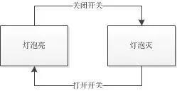

## 状态机

状态机就是状态转移图。举个最简单的例子。人有三个状态健康，感冒，康复中。触发的条件有淋雨(t1)，吃药(t2)，打针(t3)，休息(t4)。所以状态机就是：

- 健康->(t4)->健康
- 健康->(t1)->感冒
- 感冒->(t3)->健康
- 感冒->(t2)->康复中
- 康复中->(t4)->健康

就是这样状态在不同的条件下跳转到自己或不同状态的图。

状态机可归纳为 4 个要素，即现态、条件、动作、次态。这样的归纳，主要是出于对状态机的内在因果关系的考虑。“现态”和“条件”是因，“动作”和“次态”是果。详解如下：

- 现态：是指当前所处的状态。
- 条件：又称为“事件”，当一个条件被满足，将会触发一个动作，或者执行一次状态的迁移。
- 动作：条件满足后执行的动作。动作执行完毕后，可以迁移到新的状态，也可以仍旧保持原状态。动作不是必需的，当条件满足后，也可以不执行任何动作，直接迁移到新状态。
- 次态：条件满足后要迁往的新状态。“次态”是相对于“现态”而言的，“次态”一旦被激活，就转变成新的“现态”了。

在平时的业务过程中，判断即对应状态机理论中的条件，我们做什么操作改变状态即理论中的动作，同时状态必须要有始有终，否则会出现状态卡住，无法继续正常推进。

那么状态机怎样去应用呢？以物理课学的灯泡图为例，就是一个最基本的小型状态机，这里就是两个状态：① 打开开关，灯泡亮，② 关闭开关，灯泡灭可以画出以下的状态机图.

如果进度卡住，该怎么办？这里有个比较形象的案例就是淘宝的自动确认收货，卖家发货后状态变为待收货，若买家迟迟不点确认收货的话，那么流程就停止在这里，卖家也迟迟收不到货款，因此，在这里，淘宝做了一个条件，判断时间是否达到 15 天，如果达到 15 天，做出确认收货的动作，使得状态得到流转。

起始和终止状态可能是相同的，也可能是不同的，即同一种状态可能是起始状态，也可能为终止状态

### 总结

状态机图和业务流程图有些类似，但是又有不同：

1. 两种不同的思维方式
2. 两者思考的出发点不一样，因而两者所表达的目的也是不同的
3. 两者的各个节点都是不同的，流程图为动作，状态机为状态

状态机可以对业务状态进行梳理，一目了然，之后可以根据业务场景不断增加。同时，使用状态机和相关人员进行表达时，也可以更加清晰，提升沟通效率。
