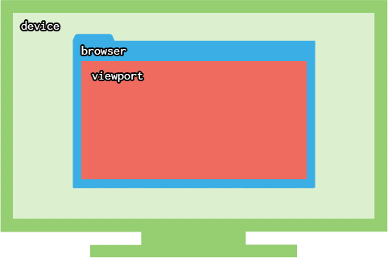

# CSS basic

> 参考 [marksheet](https://marksheet.io/why-css-exists.html)

Painting with code, while HTML is about defining the content of a webpage, CSS is about styling a webpage. It means setting colors, fonts, dimensions, margins, positions of a webpage's elements. CSS brings a webpage to life, by applying a coat of paint on its static content.

CSS 被称为使用代码绘画的工具, HTML 定义了页面内容, CSS 用来装饰页面. CSS 用来设置页面元素的颜色, 字体, 尺寸, 间距, 位置等. 通过在静态内容上应用一层样式, CSS 使网页焕然一新.

## why CSS exists

For separating content and styling.

CSS 存在的原因就是为了使内容跟样式分离.

## why avoid tables

- HTML 表格是累赘的, 需要很多的样板代码
- 语义错误, `<table>`是用来展现多维数据的
- 改变布局需要修改 HTML 的结构, 很不友好
- 容易引起语法错误
- 可读性很差

## what CSS is

CSS stands for Cascading Style Sheets(层叠式样式表). Its purpose is to style markup languages(like HTML or XML). Therefore, CSS is worthless on its own, unless associated with an HTML document. CSS brings an HTML documents to life.

CSS 指的是层叠式样式表, 它存在的目的是为了装饰标记语言(例如 HTML, XML). 因此, CSS 本身并没有多大用处, 除非它与 HTML 文档结合. CSS 赋予了 HTML 生命.

## how CSS works

how CSS works is by selecting an HTML element(like a paragraph), choosing a property to alter (like the color), and applying a certain value(like red).

CSS 是如何工作的, 它通过选择 HTML 元素, 修改 HTML 元素的属性值来工作的.

```css
p {
  color: red;
}
```

## where do i write CSS?

#### CSS as an attribute, you can write CSS directly on an HTML elements, by using the style attribute.

通过 HTML 属性 style 书写内联样式

```html
<p style="color: red; ">this text is important.</p>
```

#### CSS in the `<head>`, use `<style>` tag in the `<head>` of your HTML document.

通过在 HTML `<head>` -> `<style>`标签来书写 CSS

```html
<html>
  <head>
    <title>hello world</title>
    <style>
      p {
        color: red;
      }
    </style>
  </head>
  <body>
    <p>this text is important.</p>
  </body>
</html>
```

#### CSS in a separate file, you can write your CSS in a separate file with a `. css` extension, and then link it to your HTML by using the `<link>` HTML tag.

在单独的文件中书写 CSS,然后使用 HTML `<link>` 标签来引入

```html
<html>
  <head>
    <title>Hello world</title>
    <link rel="stylesheet" href="style.css" />
  </head>
  <body>
    <p>this text is important.</p>
  </body>
</html>
```

the 3rd method of using a separate CSS file is preferred.

## why not style directly in the HTML?

Because we want to separate the content from its presentation(CSS). it makes **maintenance** easier as well, the same CSS file can be used for a whole website. it provides **flexibility**: focus on the content on one side, the styling on the other.

为什么不把样式直接写在 HTML 当中呢? 因为我们想让内容跟修饰内容的样式分离, 这样代码维护起来相对容易一点, 相同的 CSS 文件会用在整个网站中复用而不用重复多次定义. 这种模式为我们提供了更大的灵活性: 一边我们专注内容, 另一边我们专注于样式

---

## CSS syntax

`who{ what: how; }`

the purpose of CSS is to define the layout and styling of your HTML elements.

```css
/* css rule */
selector {
  property: value;
}
```

CSS have a 3-part process:

- the selector defines who is targeted, which HTML element(s)
- the property defines what characteristic to alter
- the value defines how to alter that characteristic

- 选择器定义了要装饰的目标元素
- 属性定义要修改 HTML 元素的那个特征
- 属性值定义了要修饰元素特征的值

### quick example

```html
<blockquote>something is ready.</blockquote>
```

```css
blockquote {
  background: purple;
  color: white;
}
```

### comments

```css
/* this is a css comment */
div {
  background: purple;
}
```

### CSS selectors

CSS selectors define which elements we want out styling to be applied to.

CSS 选择器用来定义我们的样式需要应用到那个元素

### generic tag selectors 普通标签选择器

generic HTML tag selector is something like below:

```css
a {
  /* Links */
}
p {
  /* Paragraphs */
}
ul {
  /* Unordered lists */
}
li {
  /* List items */
}
```

### classes

Of all HTML attributes, the class attribute is the most important for CSS. It allows us to define a group of HTML elements that we can target specifically.

在所有 HTML 属性中，class 属性是 CSS 最重要的属性。它允许我们定义一组可以专门针对的 HTML 元素。

```html
<p class="data">something like ...</p>
```

```css
.data {
  color: red;
}
```

### ids

you can also use the `id` attribute in your HTML, and target it with a hash `#` in your CSS

```html
<p id="tagline">this is a text.</p>
```

```css
#tagline {
  color: red;
}
```

### combining selectors 组合选择器

see some examples in below:

```html
<p class="date">i am paragraph.</p>
<p>i also a <em class="date">paragraph</em>.</p>
```

```css
.date {
  color: red;
}

em.date {
  color: blue;
}
```

### hierarchy selectors 分层选择器

a **space** in a selector defines a ancestor/descendant relationship.

```css
header a {
  color: red;
}
```

this can be read from right to left as: "select all **a** elements that are within a **header** element". this will prevent all other links to remain unaffected.

### Pseudo-class selectors 伪类选择器

HTML elements can have different **states**, the most common case is when you hover over a link. it's possible in CSS to apply a different style when such an event occurs.

HTML 元素具有不同的状态, 最常见的情况是你把鼠标悬置在超链接上的时候. 当此事件发生的时候应用不同的 CSS 样式.

```css
a {
  color: blue;
}
a: hover {
  color: red;
}
```

## CSS inheritance 继承

### value propagation 值传递

The **color** value can be inherited from an ancestor.

color 属性的值将会从父元素继承

### inherited properties

only a few CSS properties can be inherited from ancestors. they are mainly text properties:

- text color
- font(family, size, style, weight)
- line-height

## CSS Priority 优先级

An HTML element can be targeted by **multiple css rules** .

### order of CSS rules

if similar selectors are in your CSS, the last one defined will take priority.

```css
p {
  color: red;
}
p {
  color: blue;
}
/* paragraphs will be blue */
```

### the 100 measure

the selector with the highest "score" will win

- `#id` selectors are worth 100
- `. class` selectors are worth 10
- `tag` selectors are worth 1

### how to avoid conflicts

- only use class
- avoid applying multiple classes on a single HTML element
- avoid use inline-styles

## CSS color units (different ways to define colors)

Colors are widely used in CSS, whether for text color, background color, gradients, shadows, borders..., there are several ways to define colors in CSS.

#### color names

Defined by color names, CSS provides 145 colors names, from the most basic (black, white, orange...) to the more specific(lawngreen, orchid...). because the color names are hard to remember, and because you probably want very specific colors, color names are not often used.

```css
body {
  background: white;
  color: red;
}
```

#### rgb

Defined by rgb, computer monitors, TVs, mobile phones, all use the RGB color model to display colors, each color is defined by a combination of Red, Green, and Blue. There are 256 possible values for Red, Green and Blue, from 0 to 255, so there are `256 * 256 * 256 = 16, 777, 216` (通常所说的 1600 万)) possible colors available.

```css
/* the black color */
body {
  color: rgb(0, 0, 0);
}

/* the white color */
body {
  color: rgb(255, 255, 255);
}

/* the red color */
body {
  color: rgb(255, 0, 0);
}

/* the green color */
body {
  color: rgb(0, 255, 0);
}

/* the blue color */
body {
  color: rgb(0, 0, 255);
}
```

#### rgba

The **rgba** color unit is **rgb** to which we add an alpha value(ranging from 0-1, in decimal values), which defines how transparent the color is.

RGBA 颜色的定义是在 RGB 的基础上添加了一个额外的透明通道, 该值为小数从 0 到 1, 定义该颜色的透明度

```css
body {
  color: rgba(0, 0, 0, 0.5);
}
```

#### hsl and hsla

HSL is another way to define a color, think of it is a color wheel.

HSL 是另外一种颜色的定义方式, 把它看做一个颜色的轮子. 通过 H, S, L 三个颜色通道的变化以及它们之间的叠加来得到各种各样的颜色.

- the **Hue** (色调) a value ranging from 0 to 360, defines which color you want.
- the **Saturation** (饱和度) percentage, ranging from 0% to 100%, define how much of that color you want.
- the **Lightness** percentage, rangring from 0% to 100%, defines how bright you want that color to be.

```css
/* the red color */
a {
  hsl(0, 100%, 50%);
}

a{
  hsl(360, 100%, 50%);
}

/* the green color */
a{
  hsl(120, 100%, 50%);
}

/* the blue color */
a{
  hsl(240, 100%, 50%);
}
```

someone thinks the **HSL** is to be human-readable, where **RGB** is more computer-readable.

**HSLA** is the same as **HSL**, with the added value of being able to define an alpha value:

```css
body {
  color: hsla(240, 100%, 50%, 0.5);
}
```

#### hexadecimal 十六进制

Colors in CSS can also be defined with hexadecimal values, like `#ffffff`.

In hexadecimal, we have 16 symbols to form numbers 0-9, A-F. just like RGB, a hexadecimal color value is a combination of Red, Green, and Blue, each of them being represent as a hexadecimal value, like `DB` for Red, `4E` for green, and `44` for Blue. hexadecimal values are easier to copy and paste.

#### which one to pick?

- if you don't intend to use any transparent color, stick to hexadecimal values, as they are easier to copy/paste and don't take much space in your code.
- if you want some transparency, convert your color from hex to rgba, and use the `rgba` color unit.
- if your want to play around with your color directly in the browser, try `hsl`.

## CSS Size units

Sizing for content and space.

there many CSS properties that require size units:

- **font-size** defines the size of the text
- **border-width** defines the weight of element borders
- **margin** defines the spacing between elements
- **left/right/top/bottom** allow to position and move elements

The most used units are:

- `px` for pixels
- `%` for percentage
- `em` for sizing relative to the parent's `font-size` value

#### pixels

because computer screens use pixels to display the content, it is the most common size unit in CSS.

```css
/* define the width of the elements */
body {
  width: 200px;
}
/* set the text size */
body {
  font-size: 20px;
}
```

Pixels in CSS are straightforward because they define absolute values: they are not affected by other inherited CSS properties.

They are also widely used for **positioning** and **spacing** purposes.

### percentage

Percentages are relative units: they rely upon the element's parent and/or ancestor.

```css
/* set block-level elements */
p {
  width: 50%;
}

/* set other CSS properties, like text size */
strong {
  font-size: 150%;
}
```

#### Em

`em` is the relative unit: it depends upon the value of the element's `font-size`.

例如父元素字体大小为 24px, 而子元素的字体大小定义为`font-size: 0.5em`, 则子元素的字体大小为 12px, 该单位通常用来定义具有伸缩响应的网页, 当你改变网页`body`的字体大小的时候, 其他的比如`h1`, `h2`. ..,`p`等元素字体的大小会跟着变化, 这样更能保证你的网页的**视觉平衡**.

#### Rem

The `rem` unit is similar to `em`, but instead of depending upon the parent's value, it relies upon the root element's value, which is the `<html>` element.

```css
html {
  font-size: 12px;
}

/* = 12px*/
body {
  font-size: 1rem;
}

/* = 24px */
h1 {
  font-size: 2rem;
}
```

#### which one to use?

recommend **pixels** to use : as they're absolute values, they aren't affected by the element's context.

## CSS Reset

Removing default browser styling

Every webpage use at least one CSS: the **User agent Stylesheet**.

#### the user agent stylesheet

this CSS file is included in the browser and is called.

- **every time** a webpage is rendered
- **before** any of our CSS is applied

尽管每一种浏览器都有自己的用户代理 CSS 默认样式, 但是它们都是类似的

#### applying a CSS reset

浏览器默认的样式会干扰我们想应用的样式, 这就是为什么要设计 **CSS 样式重置** 为所有浏览器提供一致的表现方式.

你可以使用最流行的 HTML5 Reset, 将其放置于你的`<head>`之中即可, 这里推荐:

- [normalize.css](https://github.com/necolas/normalize.css)
- [HTML5 reset.css](https://github.com/murtaugh/HTML5-Reset)

## CSS font-family

CSS provides several font properties, that directly affectly text rendering . the `font-family` property defines which font to use.

#### generic font families

have 5 generic families:

- serif
- sans-serif
- monospace
- cursive
- fantasy

because the `font-family` property is inherited by all HTML children elements, you can apply a font for the whole HTML document by applying it on the ancestor fo all HTML elements: the `<body>` element.

```css
body {
  font-family: sans-serif;
}
```

#### web-safe fonts

通常你设置的字体如果在用户的机子上不可用, 浏览器会使用默认的字体来代替, 所以你应该考虑你所采用的字体应该具有通用性, 以便你的网页的字体在任何计算机上都看起来一样, 有 9 种 web 安全字体你可以参考:

- Arial
- Arial Black
- Comic Sans MS
- Courier New
- Georgia
- Impact
- Times New Roman
- Trebuchet MS
- Verdana

#### applying a list of fonts

尽管使用单一的 web 安全字体是安全的, 但是最佳实践是给 `font-family` 赋予多个字体, 因为当赋予的第一个字体不可用的话, 浏览器会采用第二个. ..依次类推, 如果你提供的所有字体都不可用的话, 最后才使用浏览器默认的字体, 这样给浏览器更多的选择以至于使你的网页更加健壮.

## CSS font properties

For bold and italic text

#### font-size

used to set the font size among other things.

```css
h2 {
  font-size: 18px;
}
```

#### font-style

this property can make your text italic.

```css
/* default value is normal */
h2 {
  font-style: italic; /* normal, italic */
}
```

#### font-weight

this property can make your text bold.

```css
h2 {
  font-weight: bold; /* normal, bold */
}
```

Default value is `font-weight: normal;`, depending on the `font-family` used, there is a range of font weights available, from 100 - 900. very few fonts provide all 9 weights. your will mostly find 400(normal) and 700(bold), and sometimes 300(light) and 500(medium).

#### font-variant

this property turn your text into small caps:

```css
h2 {
  font-variant: small-caps;
}
```

会让你的文本变成小型的大写字母, 默认值是`font-variant: normal; `, 这个属性不常用.

## CSS line-height

For readability concerns, the `line-height` is **the height of each line**. the `line-height` property uses the following units:

- `px`
- `em`
- `%`
- unitless-umbers, like `1.5`

The unitless values basically act like percentages, so `150%` is equal to `1.5`. the latter is just more compact and readable.

#### why line-height is important

The purpose of the `line-height` is to define a readable line spacing for your text. because readability is dependent upon the size of the text, it is recommended to use a dynamic value that is relative to the size of the text. use `px` is not recommended because it defines a static value. the recommended method is unitless numbers.

- for body text, a line height of 1.5 times the size of the text is recommended.
- for heading, a line height of 1.2 is recommended.

```css
body {
  font-size: 16px;
  line-height: 1.5;
}
```

above the computed height will thus be `16 * 1.5 = 24px`

#### line-height inheritance

because the `line-height` property is inherited by the child elements, it will remain consistent no matter what `font-size` is subsequently applied.

```css
body {
  font-size: 16px;
  line-height: 1.5;
}

blockquote {
  font-size: 18px;
}
```

The `blockquote` element will have a line height of `27px`.

## CSS font shorthand

a shortcut for several font properties, it groups with this particular order:

- `font-style`
- `font-variant`
- `font-weight`
- `font-size`
- `line-height`
- `font-family`

you can thus define 6 properties through a single one:

```css
body {
  font: italic small-caps bold 16px/1.5 Arial, sans-serif;
}
```

they have to be written in this particular order and there must be a slash `/` between the `font-size` and the `line-height`. the `font-size` and `font-family` are mandatory(强制性的), others is optional. Other shorthand properties exist, like `background`, `border` and `margin`.

## CSS text properties

Other text alterations, Alongside(根据) the several `font-*` properties, CSS provides many `text-*` properties.

#### text-align

the `text-align` property must be applied on a block-level element and defines how its text and children inline elements are horizontally aligned.

该属性必须应用到块级元素, 它定义了内部的文本和行内元素水平对齐的方式. 最常用的值有:

- left
- right
- center
- justify

the `text-align` default value is `start`, basically, `start` can either be `left` or `right`, depending on the direction set on the HTML document.

**direction** is a CSS property that can either `ltr`(left to right) or `rtl`(right to left):

- if `ltr` is chosen, `start` equals to `left`
- if 'rtl' is chosen, `start` equals to `right`

#### text-decoration

the `text-decoration` property is used to add a line on your text, default value is `none`.

```css
.deleted {
  text-decoration: line-through;
}
```

possible values:

- none
- overline (上划线)
- underline (下划线)
- line-through (删除线)

#### text-indent

the `text-indent` property allows to add space before the first letter of the first line of a block-level element default value is `0`.

```css
blockquote {
  text-indent: 30px;
}
```

#### text-shadow

define:

- the `horizontal offset` 水平偏移
- the `vertical offset` 垂直偏移
- the `blur` 模糊的距离
- the `color` 颜色

Only the `x` and `y` values are required. The `blur` defaults to `0`, while the `color` defaults to the color of the text.

```css
h1 {
  text-shadow: 0 2px 5px rgba(0, 0, 0, 0.2);
}
```

## CSS box model

how rectangles are made 矩形是如何制造的?

在 HTML 中所有元素都是矩形, 矩形的尺寸会根据具体元素的内容动态调整, 你可以认为这些矩形是流体类的东西, 根据内容来调整自己的形状. 块级元素会占尽它所在的行的所有宽度, 例如段落, 它的宽度默认是浏览器的宽度, 高度适应它自己内容的高度.

## CSS background

how your rectangle is filled 你的矩形是如何填充的
the background of an HTML element is what appears behind the text.  
HTML 元素的背景指的是出现在文本后面的内容.

#### background-color

default value: `transparent` inherited by children elements: no.

```css
body {
  background: #ffffff;
}
```

#### background-image

applying a background image only requires to specify its URL:

```css
body {
  background-image: url(path/to/image.png);
}
```

the behavior of the image(how it repeats itself, where it is positioned, how it is sized) is defined by other background properties. the `background-image` only defines which image to use.

#### the difference between HTML images `` and CSS background images

the HTML `` element is for images that are part of the content, while CSS background images are purely decorative.

the logo of a company, the thumbnail of a gallery, the picture of a product ... These are all considered **content** and should use the HTML `` element.

a beautiful landscape, a cart icon...These can be considered as **decorative**, as they support the content but are not part of it. if they were to disappear, the webpage would still make sense.

因为有多重的的选择, 在内容和样式之间的界限很模糊, 一些视觉技术很容易通过 CSS 的`background`来实现, 所以如果你使用的图片是你页面的主要内容, 那么就用应该使用 `` 而不是 CSS 的 `background`.

#### background with gradients

CSS also allow to define **color gradients** as background images, in 2 different shapes:

- `linear-gradient` for gradients in a single direction, in a rectangular shape
- `radial-gradient` for gradients in all directions, in a circular shape

```css
body {
  background-image: linear-gradient(white, grey);
}
```

#### background-position

by default, a background image will repeat itself indefinitely. you can specify where its **original position** by choosing a horizontal `x` value, and a vertical `y` value.

- pixel values `px`
- percentages, relative to the HTML element's dimensions
- keywords like `center`, `left`, `bottom`. ..

```css
body {
  background-position: right bottom;
}
```

you can mix different coordinate units:

```css
body {
  background-position: center 20px;
}
```

更多的用法请参考[MDN-background-position](https://developer.mozilla.org/en-US/docs/Web/CSS/background-position)

#### background-repeat

by default, a background image will repeat itself indefinitely. you can choose to make it repeat only horizontally, only vertically, or not at all.

```css
body {
  background-repeat: repeat-x;
}

body {
  background-repeat: repeat-y;
}

body {
  background-repeat: no-repeat;
}
```

#### background-size

The background-size CSS property sets the size of the element's background image. The image can be left to its natural size, stretched, or constrained to fit the available space.

- **contain**, scales the image as large as possible within its container without cropping or stretching the image.
- **cover**, scales the image as large as possible to fill the container, stretching the image if necessary.
- **auto**, scales the background image in the corresponding direction such that its intrinsic proportions are maintained.
- **px or percentage**, stretches the image in the corresponding dimension to the specified length

## CSS display

Changing the type of an HTML element

we've seen how there are mainly 2 types of HTML elements: block-level elements and inline ones. the `display` property allows to change the type of HTML element.

#### why not use an HTML inline element, like `<span>` then?

because you choose an HTML element for its meaning, not its rendering.

因为你选择 HTML 元素主要是为了语义, 而不是为了渲染样式的目的去选择特定的 HTML 元素, 渲染交给 CSS 来做.

Each `display` options have specific rendering behaviors:

- `block` will take up the whole width available
- `inline` will act as plain text
- `inline-block` as its name suggests, a compound(复合) of block and inline behavior
- `list-item` is similar to `block` as it takes up the whole width available, but shows an additional bullet point
- `table`, `table-row` and `table-cell` all have very specific, albeit(尽管) unexpected behavior that allow more interesting layouts

#### display: block

This will turn any element into a **block** element.

This technique is often used on **links** in order to increase their clickable zone, which can be easily evaluated by setting a background color.

为了增加可点击的区域, 设置背景色, 这项技术通常用于超链接标签.

```css
.menu a {
  background: red;
  color: white;
  display: block;
}
```

### display: inline

This turns any element into **inline** elements, as if they were just simple text. it is often used to create `horizontal navigators`, where list items are semantically but not visually useful.

```html
<ul class="menu">
  <li><a href="#"> Home</a></li>
  <li><a href="#"> Features</a></li>
  <li><a href="#"> About</a></li>
</ul>
```

```css
.menu li {
  display: inline;
}
```

#### display: list-item

The only HTML elements displayed as `list-item` are the **list-items `<li>`** but also the **definition descriptions `<dd>`** .

A list item is rendered with a bullet point (if an unordered list `<ul>`) or with a incremental number(if within an ordered list `<ol>`).

Because the rendering of these bullet points and numbers varies across browsers, and is also hard to style in CSS, the `display: list-item` rule is never used. Actually, it is common for `<li>`s to be rendered as `display: block` or `display: inline`, as they are more flexible to style.

#### display: none

Applying `display: none; ` to an HTML element removes it from your webpages. as if it never existed in your code.

#### visibility: hidden

The CSS property `visibility` is slightly similar to `display`. Applying `visibility: hidden; ` hidden an element from your page, but only turns it invisible: it still takes up the space it was supposed to.

```css
.vis {
  visibility: hidden;
}
```

## CSS height and width

Setting fixed dimensions to your rectangles

The dimensions(or height and width)of an element are dynamic, as they fluctuate in order to fit the content.

```css
blockquote {
  width: 600px;
}
```

The blockquote will not take up the whole width available, but will remain 600px wide in any situation:

- if the browser window is less wide than 600px, it will show a horizontal scrolling bar
- if the browser window is wider than 600px, the blockquote will stay 600px wide and not take up the whole space

because we have only set the width, the blockquote remains fluid in height, the height becomes the variable dimension to fit the blockquote's content.

#### Setting both height and width

By setting the dimensions of an element, it will remain fixed no matter the length of its content.

### CSS overflow

The `overflow` CSS property allows us to manage the case of content being longer than its container.

The default value is `visible`: the content will be displayed anyway. By applying `overflow: hidden;`, your simply forbid any overflowing content to be seen.

#### Beware of fixed dimensions

- make sure your content doesn't overflow
- if it does, use `overflow: hidden` or `overflow: auto` to prevent your design from breaking

## CSS border

The edges of the rectangle

Because an HTML element is rendered as a rectangle, it can have up to 4 borders: top, bottom, left and right. your can set a border on all sides at once, or on each side individually.

#### border types and location

A CSS border has 3 properties:

- `border-color` defined by using a color
- `border-style` can be solid, dashed, dotted
- `border-width` defined by using a size unit

It also has 4 possible sides:

- `border-top`
- `border-bottom`
- `border-left`
- `border-right`

```css
blockquote {
  border-color: blue;
  border-style: solid;
  border-width: 1px;
}

/* The shorthand property border allows to define all 3 properties at once */
blockquote {
  border: 1px solid blue;
}
```

#### Single border

If you want to set a border on only one of the four sides, you need to include the border's position in the CSS property.

```css
blockquote {
  border-bottom-color: blue;
  border-bottom-style: solid;
  border-bottom-width: 1px;
}

/* as for the border property, each side has its shorthand version */
blockquote {
  border-bottom: 1px solid blue;
}
```

## CSS padding

To give space to your inner content, The **padding** is the space between an element's border and its content.

```css
blockquote {
  padding: 20px;
}

/* as for borders, the padding can be set individually for any of the 4 sides. */
blockquote {
  padding-top: 20px;
}
```

## CSS margin

To push away your neighbors

If padding adds space inside an element(between its border and its content), margins adds space outside between and element and other elements.

如果说内边距是在一个元素的内部的边框跟它的内容之间添加空间的话, 外边距就是在元素与元素之间添加空间

```css
p {
  margin: 40px;
}
```

#### merging vertical margins

```html
<h1 class="title"> main title</h1>
<h2 class="subtitle"> I am subtitle</h2
```

```css
> .title {
  margin-bottom: 30px;
}
.subtitle {
  margin-top: 15px;
}
```

above example, the margin between the two elements will be `30px`, not `45px`. That is because margins that "touch" each other will **merge** with each other.

记着, 相邻两个元素的外边距会重合.

#### choosing between margin and padding

it depend on your choices.

## CSS size shorthand wheel

A circle shorthand method

### setting 4 values

```css
blockquote {
  padding: 20px;
}

/* it equal as below */
blockquote {
  padding: 20px 20px;
}

/* it equal as below */
blockquote {
  padding: 20px 20px 20px 20px;
}

/* it equal as below */
blockquote {
  padding: 20px 20px 20px;
}
```

The order is `top`, `right`, `bottom` and `left`. If you enter 3 values(top/right/bottom), your omit setting `left`. As `right` is counterpart(对应), it will use its value.

#### Other properties that can act as "wheel" shorthand

- `margin`
- `padding`
- `border-width`

Indeed, `border` is(in that order) a shorthand for:

- `border-width`
- `border-style`
- `border-color`

## CSS Positioning

Breaking the flow

Even without applying any CSS, an HTML document is already styled. Its content follows a nature Flow, directly dependent on the HTML Structure.

尽管没有用 CSS 样式文件装饰, 但是 HTML 文档已经是被默认样式装饰过的. 它的内容跟随文档流, 而方向是根据 HTML 结构决定的.

But webpages often want elements to be positioned in a certain way to accomodate(容纳) for particular design needs, which requires breaking the Flow.

为了设计的需求网页通常需要将某些元素定位到特定的地方, 这样就不得不打破原有的文档流.

## The Flow

The default behavior of a webpage

An HTML document is a **living** document, Even without any CSS applied, an HTML document already has its own rules:

- **fluidity**: how the content adapts to browser dimensions 流动性
- **ordering**: in which order elements appear 有序性
- **stacking**: how elements appear on top of each other 堆叠性

#### Fluidity 流动性

In HTML, the content is king. all `block` elements are fluid, they will naturally adapt their layout to accommodate their inner content:

- **width: 100%** a block will take up the whole width available
- **word wrap** if a block's inline content doesn't fit on a single line, it will continue on a new line
- **height: auto** a block's height varies automatically to match its content's size
- A **block** is by default in full width
- Its **height** is the height of its content

#### Ordering 有序性

HTML elements are displayed in the order in which they are written in the code. First in the code -> first in the browser.

Each block appears in the order in which they appear in the HTML code, from top to bottom.

```html
<p>First</p>
<p>Second</p>
<p>Third</p>
<p>Fourth</p>
```

#### Stacking

A browser has 3 dimensions.

Each HTML element belongs to an imaginary layer.

The stack order depends on how elements are nested: child elements appear on top of their respective(各自) parents.

- Each nested element appears on top of its parent.
- The deeper in the hierarchy, the higher in the stack.

```html
<div>
  This parent is behind
  <p>This nested child appears<strong>on top</strong> of its parent</p>
</div>
```

`<strong>` tag is on top, after is `<p>`, and the last is `<div>`tag

#### Breaking the flow

Several CSS properties allow to disrupt the Flow:

- `height` and `width` can alter an element's fluidity
- `float` disrupts an element's behavior as well as its surroundings
- `position` `absolute` and `fixed` remove an element from the Flow
- `z-index` can alter the order in which elements are stacked

## CSS position

Going manual 要手动

The CSS `position` property is versatile and powerful. It allow to set or alter an element's position. It has 4 possible value:

- `static`(default value)
- `relative`
- `absolute`
- `fixed`

It's often used alongside the 4 coordinates properties:

- `left`
- `right`
- `top`
- `bottom`

#### Static

This is the default `position` value: static elements just follow the natural flow. They aren't affected by any `left`, `right`, `top` or `bottom` value.

#### relative

when the `position` is set to `relative`, an element can move according to its current position.

当将一个元素设置为`position: relative`, 它会脱离文档流, 具体偏移的位置根据其`left`, `right`, `top` and `bottom`的值来决定, 偏移是相对于其原始位置, 其相邻的其他元素并未察觉到该元素已经偏移了.

#### absolute

when the `position` is set to `absolute`, an element can move according to the **first positioned ancestor**.  
a **positioned** element is one whose `position` value is either `relative`, `absolute` or `fixed`. so unless the position is not set or static, an element is `positioned`.

The characteristic of a positioned element is that it can act as a **reference point for its child elements**.  
your can use `left`, `right`, `top` and `bottom` to move it in a position container.

**what happens if we set both left AND right?**

- if the `width` is not set, applying `left: 0` and `right: 0` will stretch the element across the whole width. it is the equivalent of setting `left: 0` and `width: 100%`.
- if the `width` is set, then the `right` value is discarded(忽略).

#### fixed

when the `position` is set to `fixed`, it acts like `absolute`: you can set left/right and top/bottom coordinates.

The only difference is that the **point of reference is the viewport**. it means that a fixed element won't scroll with the page; it is fixed on the screen.

被设置为`position: fixed`的元素与设置`position: absolute`十分相似, 只是它参考的是当前**视口**

#### sticky

元素根据正常流定位，然后相对于它最近滚动祖先。偏移值不会影响任何其他元素的位置。

## CSS float

The most unpredictable(无法预知) property

Behind the word `float`, an endless sea of possibilities(and misbehaviors).

`float` is probably the most difficult CSS concept to grasp. Its behavior can be intriguing(有趣的), unexpected, and magical(神奇的).

Probably because, of all positioning properties there are, it is the one that most influences its surroundings.

In other words, applying a float not only modifies the element it's applied upon **but also alter its ancestors, siblings, descendants, and following elements.**

`float` can only have one of these 3 values:

- `left` and `right` turns an element into a `floating` one
- `none` removes the floating aspect

#### when to use float

The purpose of floating an element is to push it to one side and make the next wrap around it.

#### float=block

floating elements will have a `display: block` applied to them automatically, and will mostly behave like block:

- you can set a specific height and width
- if no height is set, the element's height is that of the line-height
- if a `width: 100%` is applied, it will look like a block-level element

#### clearing the float

The clear property allows to **push elements** after **the float**. it can only be applied on **block** elements.

## CSS pseudo-classes

Enhancing the CSS selectors

- **generic** where `p` in CSS targets `<p>`
- **classes** where `. intro` in CSS targets elements with a `class="intro"` attribute
- **ids** where `#logo` in CSS targets HTML elements with `id="logo"` attribute

All of these selectors can have pseudo-classes attached to them. A pseudo-class:

- defines a particular state of the element
- is a keyword that starts with a colon `: `

#### Syntax

A pseudo-class cannot exist on its own. it must be attached to a selector. The pseudo-class will only define a particular state of that selector. The syntax looks like this:

```css
.selector: pseudo-class {

}
```

#### :hover

For example, a common pseudo-class used is `:hover`, which will apply a CSS style when the targeted element is **hover**.

```css
a {
  color: blue;
}

a: hover {
  color: red;
}
```

The first line defines how all `<a>` elements should look like(blue). The second line defines how `<a>` should look like when **hovered**(red).

#### :visited

This pseudo-class targets links that have been visited. by default, links are blue and turn purple when you are visited them. Google results work like that.

```css
a {
  color: blue;
}

a: visited {
  color: purple;
}
```

#### :focus

This pseudo-class happens when an HTML element is **in focus**. This is particularly useful for HTML `inputs`.

```css
.form-input {
  border: 2px solid grey;
}

.form-input: focus {
  background: green;
  border-color: blue;
  outline: none;
}
```

#### :first-child and :last-child

These pseudo-classes are related to the HTML hierarchy. They target HTML elements depending on the order in which they appear in the code.

```html
<ul>
  <li>one</li>
  <li>two</li>
  <li>three</li>
  <li>four</li>
</ul>
```

```css
li: first-child {
  background: red;
}

li: last-child {
  background: green;
}
```

#### :nth-child

This pseudo-class is a more global version of `:first-child` and `:last-child`. with `:nth-child`, your can calculate which child element you want to target.

```css
/* target the second element */
li: nth-child(2) {
  background: violet;
}

/* odd and even  */
li: nth-child(odd) {
  background: gold;
}

li: nth-child(even) {
  background: green;
}
```

The n iterator  
The most powerful aspect of `:nth-child` is how it can target elements based upon calculations by using the `n` keyword. The `n` value increments from **one** to the **number** of child elements present.

```css
/* every third element */
li: nth-child(3n) {
  background: red;
}

/* n+1 */
/* what if you want to target the 1st item and every third item  */
li: nth-child(3n + 1) {
  background: red;
}
```

#### Other pseudo-classes

There are dozens of pseudo-classes available, some of them for very specific states. The most used ones are the one's we've covered.

## CSS gradients

From one color to another

When we talk about gradients in CSS ,we talk about gradients of colors. There are 2 types of gradients in CSS:

- **linear**: colors go from point to another, in a straight line
- **radials**: colors go from the center of a circle to its edges, in all directions

A gradient is considered a `background image` and must be used with the according property.

### linear-gradient

The syntax for linear gradients is quite complex ,but the basic idea is to define:

- which color you want
- where these colors must appear along the axis(at the start, middle, end, etc)
- in which direction the gradient must go

```css
div {
  background-image: linear-gradient(red, blue);
}
```

by default:

- the **direction** is **vertical**, from top to bottom
- the **first** color is at the **start**(top)
- the **second** color is at the **end**(bottom)

#### change the direction

if to top to bottom direction doesn't suit you, you can alter it by either:

- defining the destination of the gradient, with keywords like **to left top**
- defining a special angel in degree like `45deg`

the direction must be set before the colors:

```css
div {
  background-image: linear-gradient(to bottom right, yellow, purple);
}
```

if you want a more specific angle, you can use a value in degrees:

- `0deg` in the default value, from top to bottom
- `20deg` is lightly diagonal, going clockwise
- `90deg` is like 3pm, from right to left.
- `180deg` is from bottom to top

#### Adding more colors

you can insert as many colors as you want. they will be equally distributed along the axis:

- **2 colors**: 0% and 100%
- **3 colors**: 0%, 50% and 100%
- **4 colors**: 0%, 33%, 67% and 100%

```css
div {
  background-image: linear-gradient(blue, green, red);
}
```

#### setting specific color stops

if you don't want colors to equally distributed, you can set specific color stop positions, using either percentages `%` or pixels `px`

```css
div {
  background-image: linear-gradient(orange, grey 10%, yellow 50%);
}
```

In this setup:

- `orange` has no stop position, so it default to zero `0%`
- `grey` is closer to the top, at `10%` instead of `50%`

### radial-gradient

while linear gradients follow a single-line axis, **radial gradients** spread out in all directions. Their syntax is fairly similar to linear ones, as they both have **color stops**. but instead of specifying a direction you need to specify:

- a shape: either a circle or an ellipse
- a starting point: which will be the center of the circle/ellipse
- an end point: where the edge of the circle/ellipse will be

```css
div {
  background-image: radial-gradient(red, yellow);
  width: 200px;
}
```

by default :

- the gradient is an ellipse
- the first color starts at the center
- the last color ends at the farthest corner

#### start position

the **start position** works like `background positions`, you set it with the `at` keyword.

```css
div {
  background-image: radial-gradient(at top right, black, red);
}
```

#### end position

by default, the shape will end at the `farthest corner`, you can either choose:

- `closest-side`
- `closest-corner`
- `farthest-side`
- `farthest-corner`

The different is both hard to grasp and to visualize, so i won't go into detail. Mozilla has a [good description of the different values](https://developer.mozilla.org/en-US/docs/Web/CSS/radial-gradient#Values)

```css
div {
  background-image: radial-gradient(closest-corner at 20px 20px, green, blue);
  width: 300px;
}
div: hover {
  background-image: radial-gradient(farthest-side at 20px 20px, green, blue);
}
```

#### fixed size

instead of setting both start and end position, you can just set **specific dimensions**

```css
div {
  background-image: radial-gradient(20px 10px at 75% 50%, red, blue);
  width: 300px;
}
```

CSS gradients are powerful, considering how endless the options are. you can write some buttons with CSS gradient.

```css
.button-grey {
  background-image: linear-gradient(#f2f2f2, #f2f2f2);
}
.button-yellow {
  background-image: linear-gradient(#fce374, #fcdf5b);
}
.button-orange {
  background-image: linear-gradient(#f58a38, #f57c20);
}
.button-red {
  background-image: linear-gradient(#ed6d64, #ed574c);
}
.button-purple {
  background-image: linear-gradient(#847bba, #7568ba);
}
.button-blue {
  background-image: linear-gradient(#42b0e3, #2ba9e3);
}
.button-green {
  background-image: linear-gradient(#97cc76, #8bcc62);
}
```

---

## CSS transitions

From one rule to another

CSS transitions allow to smoothly go from one element's state to another, how it works is that individual properties are animated from an initial to a final state.

you can define:

- `transition-property`: which properties to animate
- `transition-duration`: how long the animation lasts
- `transition-timing-function`: how the intermediate states are calculated
- `transition-delay`: to start the animation after a certain amount of time

you can set each CSS property individually or use the shorthand version `transition`, in that case only the duration is mandatory keep in mind that a transition is a special kind of animation. where there's only a start and an end state.

### quick example

Transitions are often used on hover states.

```html
<a href="#" class="with-transition"> i am with transitioned</a>
```

```css
a {
  background: lightgrey;
  color: grey;
}

a: hover {
  background: yellow;
  color: red;
}

a.with-transition {
  transition: 1s;
}
```

### transition-duration

A transition's duration is the only CSS property needed to create a transition. it can either be set in seconds `2s` or milliseconds `100ms`

```css
a {
  background: lightgrey;
  color: grey;
}
a: hover {
  background: yellow;
  color: red;
}
a.with-fast-transition {
  transition: 0.5s;
}
a.with-slow-transition {
  transition: 2s;
}
```

### transition-property

only 1/3 of CSS properties can be animated. Mozillia has a [complete list](https://developer.mozilla.org/en-US/docs/Web/CSS/CSS_animated_properties), by default, the `transition-property` property has a value of `all`, which simply means it will animate all possible properties. you can decide to only animate 1 or several properties.

```css
a {
  background: lightgrey;
  color: grey;
}
a: hover {
  background: yellow;
  color: red;
}
a.with-background-transition {
  transition-property: background;
  transition: 0.5s;
}
a.with-all-transition {
  transition: 2s;
}
```

### transition-timing-function

The timing function determines how each property's value is calculated during the transition. by default, the transition is ease: it accelerates at the start and slows at the end.

- `ease` slow start, fast middle, slow end
- `linear` constant speed
- `ease in` slow start, fast end
- `ease out` fast start, slow end
- `ease in out` like ease, but with more pronounced acceleration/deceleration curves(曲线)

if you want to visualize how other timing functions work, check out this [Easing Functions Cheat Sheet](http://easings.net/)

```css
div {
  left: 0;
  position: relative;
  transition: 1s;
  transition-timing-function: ease;
}
div: hover {
  left: 200px;
}
```

### transition-delay

A delay will define how long the transitions has to wait before actually starting. like `transition-duration` you can either use seconds `s` or milliseconds `ms`.

```html
<div>
  <p>hover the grey area</p>
  <a href=""> without any delay</a>
  <a href="" class="with-delay"> with a second delay</a>
</div>
```

```css
a {
  background: blue;
  color: white;
  transition: all 1s;
}
div: hover a {
  background: red;
}
a.with-delay {
  transition-delay: 1s;
}
```

---

## CSS animations

a set sequence of CSS Rules  
We have just seen how CSS transitions are just a way to animate CSS properties between a starting state, and an end state. so CSS transitions are specific kind of animations, where:

- there is only 2 states: start and end
- the animation doesn't loop
- the intermediate states are only controlled by the timing function

**CSS animations are like mini movies where you are the director giving out instructions(CSS rules) to your actors (HTML elements) for different scenes(keyframes). **

### Animation properties

like the `transition` property, `animation` is a shorthand property for several others:

- **name**: the animation's name
- **duration**: how long the transition lasts
- **timing-function**: how the intermediate states are calculated
- **delay**: to start the animation after a certain amount of time
- **iteration-count**: how many times the animation should be performed
- **direction**: if the animation should be reversed or not
- **fill-mode**: what styles are applied before the animation starts and after it ends

### quick example

To animate a loading button, you could write a bouncing animation:

```css
@keyframes bouncing {
  0% {
    bottom: 0;
    box-shadow: 0 0 5px rgba(0, 0, 0, 0.5);
  }
  100% {
    bottom: 50px;
    box-shadow: 0 50px 50px rgba(0, 0, 0, 0.1);
  }
}
.loading-button {
  animation: bouncing 0.5s cubic-bezier(0.1, 0.25, 0.1, 1) 0s infinite alternate
    both;
}
```

- name: bouncing
- duration: 0.5s
- timing-function: cubic-bezier(0.1, 0.25, 0.1, 1)
- delay: 0s
- iteration-count: infinite
- direction: alternate(goes back and forth)
- fill-mode: both

### @keyframes

before applying animation to HTML elements, you need to **write animations using keyframes**. basically, keyframes are each **intermediate step** in an animation. They are defined using **percentages**.

- **6%** is the first step of the animation
- **50** is the step halfway through the animation
- **100%** is the last step

you can also use the keywords `from` and `to` instead of **0%** and **100%** respectively. Each keyframes is **CSS rule**, meaning that you can write CSS properties just like usually. To define an animation, just write the keyword `@keyframes` followed by it **name**.

```css
@keyframes around {
  0% {
    left: 0;
    top: 0;
  }
  25% {
    left: 240px;
    top: 0;
  }
  50% {
    left: 240px;
    top: 140px;
  }
  75% {
    left: 0;
    top: 140px;
  }
  100% {
    left: 0;
    top: 0;
  }
}
p {
  animation: around 4s linear infinite;
}
```

### animation-name

The animation name is used at least twice

- when writing the animation using `@keyframes`
- when using the animation using the `animation-name` property (or with the animation shorthand)

```css
@keyframes whatever {
  /* ... */
}
.selector {
  animation-name: whatever;
}
```

### animation-duration

`animation-duration` can be set in seconds `1s` or milliseconds `200ms`

```css
.selector {
  animation-duration: 0.5s;
}
```

it defaults to `0s`, which means no animation at all.

### animation-timing-function

just like `transition timing-functions`, animation timing functions can use keywords like `linear`, `ease-out`, or be defined using custom `cubic bezier` functions.

```css
.selector {
  animation-timing-function: ease-in-out;
}
```

it defaults to `ease`.

### animation-delay

just like `transition delays`, animation delays can be set in seconds `1s` or milliseconds `200ms`. it defaults to `0s` which means no delay at all, it's useful when triggering multiple animations in sequence.

```css
.a,
.b,
.c {
  animation: bouncing 1s;
}
.b {
  animation-delay: 0.25s;
}
.c {
  animation-delay: 0.5s;
}
```

### animation-iteration-count

by default, animations are only played once(value of `1`), you can set 3 types of values:

- integers like `2` or `3`
- non-integers like `0.5` which will play only half the animation
- the keyword `infinite` which will repeat the animation indefinitely

```css
.selector {
}
```

### animation-direction

The animation's direction defines in which order the keyframes are read

- **normal**: starts at `0%`, ends at `100%`, starts at `0%` again
- **reverse**: starts at `100%`, ends at `0%`, starts at `100%` again
- **alternate**: starts at `0%`, goes to `100%`, goes to `0%`
- **alternate-reverse**: starts at `100%`, goes to `0%`, goes to `100%`

### animation-fill-mode

an animation's fill mode defines what happens before the animation starts and after it ends. the detail you can find [here](http://marksheet.io/css-animations.html#animation-fill-mode)

---

## CSS transform

Fashioning unique shapes

CSS transforms are a collection of functions that allow to shape elements in particular ways:

- **translate**: moves the element along up to 3 axis (x, y and z)
- **rotate**: moves the element around a central point
- **scale**: resize the element
- **skew**: distorts(扭曲) the element

### transform properties

There are 3 CSS transform properties available:

- `transform` define which transform function to use (translate, rotate, scale)
- `transform-origin` allows to modify the origin point of a transformation (works like `background positions`)
- `transform-style` is for 3d settings

### Doesn't break the flow

to prevent unexpected behavior, transformed elements do not affect the flow, whether rotated, scaled or translated, the won't affect other elements.

### translate

The `translate()` function allows to move an element across the plane(on the x and y axis). it accepts either:

- 1 parameter: moves the element along the `x` axis
- 2 parameter: first value is for the `x` axis, second for the `y` one

```css
@keyframes translating {
  0% {
    transform: translate(0, 0);
  }
  25% {
    transform: translate(240px, 0);
  }
  50% {
    transform: translate(240px, 140px);
  }
  75% {
    transform: translate(0, 140px);
  }
  100% {
    transform: translate(0, 0);
  }
}
p {
  animation: translating 4s linear infinite;
}
```

Remember: `transform` is the CSS property, `translate()` is the CSS value attached to that property (and also happens to be a function).  
you can use `translateX()` and `translateY()` to only move your element along the `x` and `y` axis respectively.

### rotate

The `rotate()` function allows to make an element revolve around a fixed point. By default, it revolves around the element's center.

`rotate()` accepts only 1 parameter, which is an angle value defined in degrees `deg`, gradians `grad`, radians `rad` or turns `turn`(which 1 turn being equivalent to a full circle).

```css
@keyframes rotating {
  0% {
    transform: rotate(0deg);
  }
  100% {
    transform: rotate(360deg);
  }
}
p {
  animation: rotating 4s linear infinite;
}
```

### scale

The `scale()` function allows to **resize an element**. It can either expand(扩大) or shrink(缩小) it. The function accepts either:

- 1 parameter: the element is resized uniformily in height and width
- 2 parameter: the first value resizes the element horizontally, the second one vertically

The range of possible value is :

- `1` :the element retains its original size
- `2` : the element doubles in size
- `0.5` : the element is half of its size
- `0` : the element basically disappears (as its height and width are equal to zero)
- `-1` : the element is mirrored

```css
@keyframes scaling {
  0% {
    transform: scale(1);
  }
  20% {
    transform: scale(2);
  }
  40% {
    transform: scale(0.5);
  }
  60% {
    transform: scale(0);
  }
  80% {
    transform: scale(-1);
  }
  100% {
    transform: scale(1);
  }
}
p {
  animation: scaling 10s steps(1) 0s infinite;
}
```

like `translate()`, the `scale()` function has x and y versions: `scaleX()` and `scaleY()` to resize horizontally and vertically respectively.

### skew

The `skew()` function allows to distort(扭曲) an element, by dragging its sides along a line basically.

This transform function is rarely used, as its effects are quite unpredictable(无法预知), and its results not necessarily appealing, nevertheless(然而), let's see how it works.

Like `scale()`, the `skew()`function accepts either:

- 1 parameter: the element is distorted horizontally
- 2 parameter: the first value distorts the element horizongtally, the second one _vertically_

And like `rotate()`, `skew()` only accepts angle value like degrees `deg`.

```css
@keyframes skewing {
  0% {
    transform: skew(0deg);
  }
  20% {
    transform: skew(10deg);
  }
  40% {
    transform: skew(45deg);
  }
  60% {
    transform: skew(90deg);
  }
  80% {
    transform: skew(120deg);
  }
  100% {
    transform: skew(0deg);
  }
}

p {
  animation: skewing 10s steps(1) 0s infinite;
}
```

### 3d functions

3d version of `translate()`, which is `translate3d()`, and performs transformation along 3 dimensions, which means it includes the **z axis** as well(and as such, a standalone `translateZ()` function exists as well).

The **z** parameter basically make the element move closer and further, whether we increase or decrease its value.

```css
@keyframes zooming {
  0% {
    transform: translate3d(0, 0, 0);
  }
  100% {
    transform: translate3d(0, 0, 200px);
  }
}
```

---

## CSS responsiveness

Designing for every screen.

The Web is meant to provide a platform to share information easily across the internet, no matter which device the information is viewed on. while the only disparities between computers accessing the Web consisted mostly upon different screen resolutions, the rapid growth of mobile devices has changed the requirements: a website needs to be accessible on mobile in order to be relevant.

what options are available to handle mobile devices?

1. Not doing anything and let mobile users zoom in to read your website.
2. create a second website, like [m.facebook.com](http://m.facebook.com), and direct mobile devices to that website
3. use responsive web design

### device, browser, viewport

before going further, we need to define some terms:

- **device** the hardware used: smartphone, tablet, pc or laptop
- **browser** the software running: Firefox, Google Chrome, Safari, Internet Explorer
- **viewport** the region within the browser that actually displays the webpage.



### Responsive web design

The idea behind **responsive web design** is to make your website adapt to fit to any device.it does so by targetting devices with your CSS and applying certain styles on these devices only. Responsiveness relies upon the properties of either the device or the viewport. For example:

- how wide is the viewport?
- how high is the viewport?
- how is the viewport oriented(朝向)?
- what is the device's resolution(分辨率)?

depending on the answer to these questions, a responsive CSS will apply different or additional CSS rules.

Up until now, every part of our CSS was used by every device that accessed out website. Responsive web design allow us to apply certain styles in certain cases.

### media queries

We need to write blocks in our CSS that will only be used by devices that match that block's criterias(标准). these blocks are called **media queries**.

```css
/* This part is read by every device/viewport */
body {
  font-size: 14px;
}

@media (min-width: 1200px) {
  /* This part is only read by viewports wider than 1200px */
  body {
    font-size: 16px;
  }
}
```

here, the default text size is `14px`, but to accommodate for larger viewports, the text size is set to `16px` if the viewport is wider than 1200 pixels.

### several parameters

you can require **2 conditions** for a media query to be activated.

```css
body {
  font-size: 18px;
}
@media (min-width: 1000px) and (orientation: landscape) {
  body {
    font-size: 20px;
  }
}
```

### several CSS rules

you can include as many CSS rules as you want in the media query.

### parameters

Media queries require parameters which act like conditions that need to be filled in order for the media query to be activated. By writing `@media (min-width: 1200px)`, we tell the browser to read this block only if the viewport is wider than 1200px;

#### width

The `width` parameter is the most used one in responsive web design. this comes from the fact that webpages are read vertically.

#### height

The `height` parameter works like the width one, expect it performs its checks on the viewports's height. you can use `min-height` and `max-height`. it's rarely used, as websites are mainly scrollable vertically.

#### orientation

The orientation parameter can detect if the viewport is in either of the following modes:

- **landscape**: the viewport is wider than it is tall
- **portrait**: the viewport is taller than it is wide

```css
@media (orientation: portrait) {
  /* for vertical viewports */
}
@media (orientation: landscape) {
  /* for horizontal viewports */
}
```

Although it's mostly used for tablets and smartphones, be aware that even on a widescreen monitor, the viewport can be in portrait if its width is smaller than its height.

#### resolution

The `resolution` parameter is relevant to the `device's pixel density`, and can be expressed in either dots per inch `dpi` or dots per centimeter `dpcm`. it depends on:

- what your resolution is (like 1440x900, 1024x768 etc.)
- what your screen's diagonal is (like 11, 14, 21 etc.)

the pixel density basically tells how **crisp** your display is (the higher the dpi, the crisper the display).

```css
@media (min-resolution: 300dpi) {
  /*  */
}
```

Desktop screens usually have a pixel density around `100` dpi, smartphones on the other hand have an incredible range of dpi, for example:

- Apple iPhone 6+: 401dpi
- Google Nexus 5: 445dpi
- HTC One: 469dpi
- Samsung Galaxy S6: 577dpi

What role does CSS play here? well, higher resolution screens will rend text very clearly: individual pixels become hardly noticeable and letters look absolutely smooth.

The problem is with **images** on Retina displays for example. it's a long topic, so read this [CSS Techniques for Retina](https://www.sitepoint.com/css-techniques-for-retina-displays/)

A Use case would be to provide a default background image for every device, and apply **high resolution background images** on Retina displays.

```css
/* 40x40 logo */
.logo {
  background-image: url(marksheet-logo.png);
  background-size: 40px 40px;
}
@media (min-resolution: 300dpi) {
  /* 80x80 logo resized to 40x40 */
  .logo {
    background-image: url(marksheet-log@2x.png);
  }
}
```

keep in mind that the **background size must be set**. Otherwise, the `@2x` Retina image would take twice the space.

> The `@2x` suffix is just Apple's notation for Retina images, and has been adopted as the de facto default notation in CSS.

### mobile-first or desktop-first

A mobile-first CSS would use `min-width` media queries in order to apply special rules for large viewports:

```css
@media (min-width: 768px) {
  /* Rules for tablets and bigger viewports */
}

@media (min-width: 992px) {
  /* Rules for laptops, small desktop screens and bigger viewports */
}

@media (min-width: 1200px) {
  /* Rules for large desktop screen only */
}
```

A desktop-first approach starts with styles for large screens and `max-width` media queries in order to apply special rules for large viewports.

```css
@media (max-width: 1199px) {
  /* rules for laptops, small desktop screens, and smaller viewports */
}

@media (max-width: 991px) {
  /* rules for tablets and smaller viewports */
}

@media (max-width: 767px) {
  /* rules for smartphones only */
}
```

---

## scss

If your have found yourself having to repeat code throughout your CSS, replace several instance of the same value, or lose yourself in a mess of selectors, CSS preprocessor are for you.

Preprocessor are, as their name suggest, tools that have their own language and will generate regular CSS file.

### Sass vs SCSS

- Sass itself(Syntactically Awesome StyleSheets) in `. sass` files
- SCSS(Sassy on CSS) in `. scss` files, which is something halfway between regular CSS and Sass

Remember that:

- Sass is the name of the preprocessor
- SCSS is easy learn
- all resources on the internet mention Sass, not SCSS
- all feature are available for both syntaxes
- everything in SCSS is available in Sass

### why SCSS first

- readability: the syntax is very similar to CSS
- learning curve: it only and a few additional features on top of CSS
- compatibility: a CSS file is a valid SCSS file
- resources: lots of online articles to read and open source libraries to use
- expandability: it's easy to go from SCSS to Sass

### features

- variable
- nesting
- mixin: custom functions that can accept parameters and will prevent useless repetitions
- extensions: an easy way to inherit the same properties of another selector
- operators: adding/subtract/multiply/divide values, like `960px / 4` or `$space * 2`

### DRY code

- variable prevent repeating values
- nesting prevent repeating selectors
- mixins and extensions prevent repeating properties

### variables

you need to prepend a variable with a `$` dollar sign:

```scss
$yellow: #fce473;

body {
  background-color: $yellow;
}
```

### Sass nesting

In Sass, nesting CSS rules allows to define hierarchy selectors:

```scss
.title {
  strong {
  }
  em {
  }
}
```

to prevent rewriting the same parent selector, use the `&` instead

```scss
.title {
  &: hover {
    color: purple;
  }
}
```

it will generate:

```css
.title: hover {
  color: purple;
}
```

### mixins

When you find yourself writing the same code over and over again, it feels like Sass mixins might help your out.

Sass mixins are CSS functions that you can include whenever you want.

```scss
@mixin overlay() {
  bottom: 0;
  left: 0;

  right: 0;
  top: 0;
  position: absolute;
}
```

you can reference this mixin in any CSS rule by using `@include`

```scss
.modal-background {
  @include overlay();
  background: black;
  opacity: 0.9;
}
```

As usual, this `. scss` will be compiled into `. css`.

```css
.modal-background {
  bottom: 0;
  left: 0;
  position: absolute;
  right: 0;
  top: 0;
  background: black;
  opacity: 0.9;
}
```

### mixin with parameters

Because mixins are functions and because you might want to alter the output, mixins can accept parameters.

```scss
@mixin border-radius($radius) {
  -webkit-border-radius: $radius;
  -moz-border-radius: $radius;
  border-radius: $radius;
}

.box {
  @include border-radius(3px);
}
```

output:

```css
.box {
  -webkit-border-radius: 3px;
  -moz-border-radius: 3px;
  border-radius: 3px;
}
```

Optional parameters: if you want a parameter to have a default value while providing the possibility to set one occasionally, you can create optional parameters:

```scss
@mixin my-font-size($size: 12px) {
  font-size: $size;
}
```

### Sass extend

A Sass `@extend` allow inheriting CSS properties from another selector:

```scss
.dark-theme {
  background: black;
  color: #fff;
}

.my-theme {
  @extend .dark-theme;
}
```

Difference with mixins:

- The `@extend` rule doesn't have parameter. mixin do.
- The `@extend` rule does combine selectors. mixin don't.

A Sass `@extend` is more efficient, as it only writes the common properties once.

### Placeholders

Well, you might be thinking "The .small-uppercase isn't semantic! I could use it in my HTML! "?

You're right, and that's why placeholders exist in Sass.

```scss
%common-theme {
  color: white;
  background: black;
}

.my-theme {
  @extend %common-theme;
}
```

When in doubt, use mixins. They generate more CSS lines and are less elegant than extend/placeholders, but they are straightforward.
