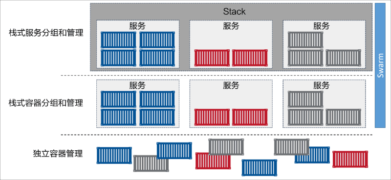

## stack

Stack 位于 Docker 应用层级的最顶端。Stack 基于服务进行构建，而服务又基于容器



## docker 常用命令

```
# 登录docker
docker login

# 给指定镜像打tag
docker tag <image> username/repository:tag

# 上传镜像到仓库
docker push username/repository:tag

# 从仓库运行镜像
docker run username/repository:tag

# 构建docker镜像
docker build --tag username/repository:tag .

# 运行指定镜像
docker run -p 4000:80 username/repository:tag

# 在后台运行指定镜像
docker run -d -p 4000:80 username/repository:tag
```

#### 容器操作

```
# 列出运行中的容器
docker container ls

# 列出所有容器
docker container ls -a

# 停止指定 <hash> 的容器
docker container stop <hash>

# 强制关闭指定 <hash> 的容器
docker container kill <hash>

# 删除指定 <hash> 的容器
docker container rm <hash>

# 删除所有容器
docker container rm $(docker container ls -a -q)
```

#### 镜像操作

```
# 列出所有镜像
docker image ls -a

# 删除指定id的镜像
docker image rm <image id>
# 删除所有镜像
docker iamge rm $(docker image ls -a -q)
```
