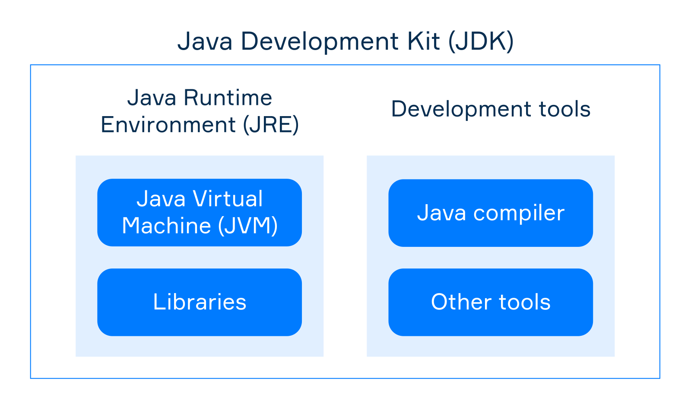
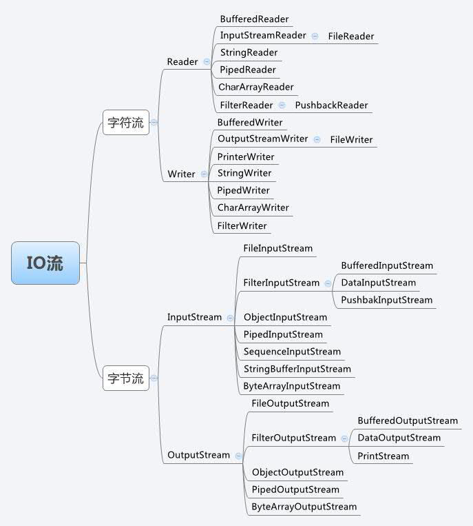

# 常用概念

## 基本类型转换

除了布尔类型的数据，Java 允许任何基本类型的数据转换为另一种基本类型的数据。当我们进行向下转换类型时，需要注意结果的范围是否溢出，否则我们就很可能在不知不觉中丢失精度。

## POJO(plain ordinary java object)

简单的 Java 对象，实际就是普通 JavaBeans，是为了避免和 EJB 混淆所创造的简称。POJO 主要用来指代那些没用遵从特定的 Java 对象模型，约定或框架如 EJB 的 Java 对象。理想地讲，一个 POJO 是一个不受任何限制的 Java 对象（除了 Java 语言规范）。

## JavaBean

JavaBean 是一种 JAVA 语言写成的可重用组件。它的方法命名，构造及行为必须符合特定的约定：

- 这个类必须有一个公共的缺省构造函数。
- 这个类的属性使用 getter 和 setter 来访问，其他方法遵从标准命名规范。
- 这个类应是可序列化的。

因为这些要求主要是靠约定而不是靠实现接口，所以许多开发者把 JavaBean 看作遵从特定命名约定的 POJO。

## JavaBean 跟 POJO 区别

POJO 和 JavaBean 是我们常见的两个关键字，一般容易混淆，POJO 全称是 Plain Ordinary Java Object / Pure Old Java Object，中文可以翻译成：普通 Java 类，具有一部分 getter/setter 方法的那种类就可以称作 POJO.

但是 JavaBean 则比 POJO 复杂很多， Java Bean 是可复用的组件，对 Java Bean 并没有严格的规范，理论上讲，任何一个 Java 类都可以是一个 Bean 。但通常情况下，由于 Java Bean 是被容器所创建（如 Tomcat) 的，所以 Java Bean 应具有一个无参的构造器，另外，通常 Java Bean 还要实现 Serializable 接口用于实现 Bean 的持久性。 Java Bean 是不能被跨进程访问的。JavaBean 是一种组件技术，就好像你做了一个扳子，而这个扳子会在很多地方被拿去用，这个扳子也提供多种功能(你可以拿这个扳子扳、锤、撬等等)，而这个扳子就是一个组件。一般在 web 应用程序中建立一个数据库的映射对象时，我们只能称它为 POJO。

POJO(Plain Old Java Object)这个名字用来强调它是一个普通 java 对象，而不是一个特殊的对象，其主要用来指代那些没有遵从特定的 Java 对象模型、约定或框架（如 EJB）的 Java 对象。理想地讲，一个 POJO 是一个不受任何限制的 Java 对象（除了 Java 语言规范）。

## 函数签名

函数的名称跟参数的组合叫做函数签名，签名不包括

- the returning type 返回类型
- modifiers 修饰符
- names of parameters 参数名称

```java
// Here are some examples of other signatures:
// sum(double, double)
// min(long, long, long)
// getValue()
```

## 传参

When you call a method with a value of a primitive type then a copy of the value is created. Inside a method, you can process this copy. If you change it, the passed argument is not changed.

在方法中传递主要类型的参数，其实传递的是该参数的一个副本，所以在方法体中修改了传递的参数并不会影响原来的值。

## 为什么要定义方法

Define a new method if you'd like to re-use a part of your code, or if the part is a well-separated code that can be changed independently. Methods allow you to decompose a program into some well-understood subroutines and manage them conveniently.

如果你想重用你代码的一部分那么定义一个方法，或者如果该部分能够很容易被拆分并且能够独立的去改变。方法允许你把一个程序拆分成多个很好理解的子程序并且方便管理它们。

## java 中的 String

它是引用数据类型，不是基本数据类型，它不可变。

## jvm jre jdk 的关系



## 什么是流

Java 所有的 I/O 机制都是基于数据流进行输入输出，这些数据流表示了字符或者字节数据的流动序列。Java 的 I/O 流提供了读写数据的标准方法。任何 Java 中表示数据源的对象都会提供以数据流的方式读写它的数据的方法。

标准输入输出，文件的操作，网络上的数据流，字符串流，对象流，zip 文件流等等，java 中将输入输出抽象称为流，就好像水管，将两个容器连接起来。将数据冲外存中读取到内存中（供 Java 程序使用）的称为输入流，将数据从内存写入外存中的称为输出流。

流是一个很形象的概念，当程序需要读取数据的时候，就会开启一个通向数据源的流，这个数据源可以是文件，内存，或是网络连接。类似的，当程序需要写入数据的时候，就会开启一个通向目的地的流。

流是一组有顺序的，有起点和终点的字节集合，是对数据传输的总称或抽象。即数据在两设备间的传输称为流，流的本质是数据传输，根据数据传输特性将流抽象为各种类，方便更直观的进行数据操作。



字符流的由来, 因为数据编码的不同，而有了对字符进行高效操作的流对象。本质其实就是基于字节流读取时，去查了指定的码表。

字节流和字符流的区别：

- 读写单位不同：字节流以字节（8bit）为单位，字符流以字符为单位，根据码表映射字符，一次可能读多个字节。
- 处理对象不同：字节流能处理所有类型的数据（如图片、avi 等），而字符流只能处理字符类型的数据。
- 结论：只要是处理纯文本数据，就优先考虑使用字符流。除此之外都使用字节流。

方向性：

流分为输入流和输出流。但这都是相对的。这里，我们可以做个区分,序列化，就是把数据做字节流处理。而字节流只是一种存储形式。他不会被程序识别，需要把字节流反序列化为 java 识别的对象，才可以被 java 程序识别。所以，序列化就是字节流化，就是从 java 代码或内存中输出到外存。而反序列化就是对象化，就是从外存中将字节流数据转化为程序识别的对象。

## 重载 Overload，覆盖 Override, 多态

一个方法名，参数不同，这叫方法重载。(Overload)

```java
void foo(String str);
void foo(int number);
```

父类与子类有同样的方法名和参数，这叫方法覆盖。(Override)

```java
class Parent {
    void foo() {
        System.out.println("Parent foo()");
    }
}
class Child extends Parent {
    void foo() {
        System.out.println("Child foo()");
    }
}
```

父类引用指向子类对象，调用方法时会调用子类的实现，而不是父类的实现，这叫多态。

```java
Parent instance = new Child();
instance.foo(); //==> Child foo()
```

我理解的多态与继承体系有关，与方法覆盖有关，与方法重载无关。
