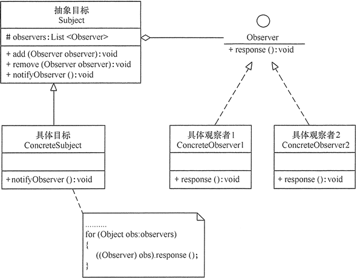
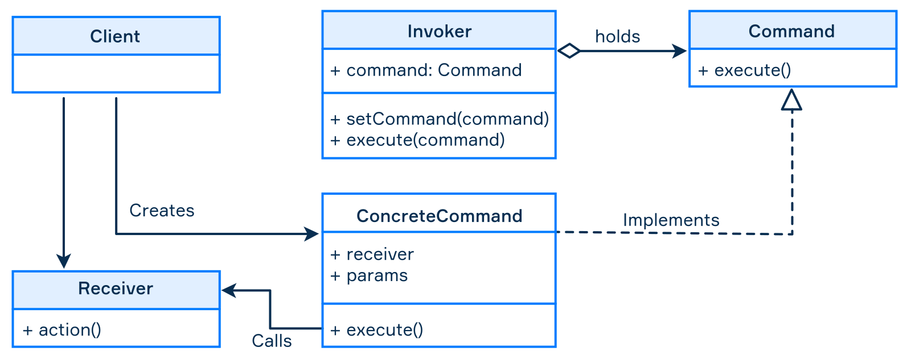
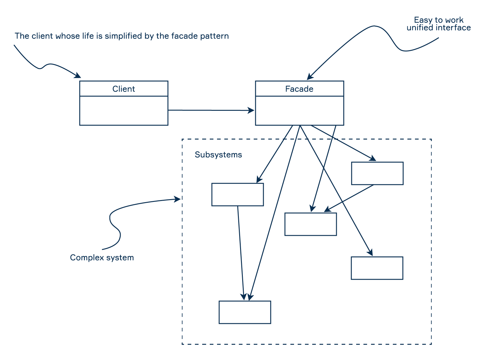
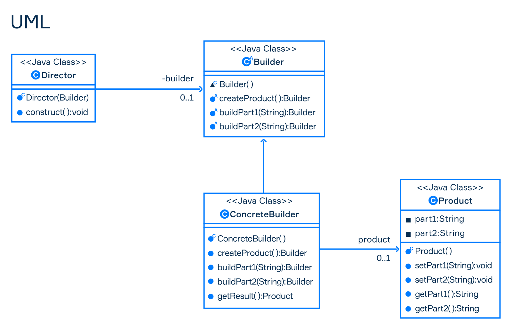

# 设计模式 Design pattern


## 单例模式 singleton

指一个类只有一个实例，且该类能自行创建这个实例的一种模式。

单例模式有 3 个特点:

- 单例类只有一个实例对象；
- 该单例对象必须由单例类自行创建；
- 单例类对外提供一个访问该单例的全局访问点

单例模式的优点:

- 单例模式可以保证内存里只有一个实例，减少了内存的开销。
- 可以避免对资源的多重占用。
- 单例模式设置全局访问点，可以优化和共享资源的访问。

单例模式的缺点:

- 单例模式一般没有接口，扩展困难。如果要扩展，则除了修改原来的代码，没有第二种途径，违背开闭原则。
- 在并发测试中，单例模式不利于代码调试。在调试过程中，如果单例中的代码没有执行完，也不能模拟生成一个新的对象。
- 单例模式的功能代码通常写在一个类中，如果功能设计不合理，则很容易违背单一职责原则。

```java
class Singleton {
    private static Singleton instance;

    private Singleton() { }

    public static Singleton getInstance() {
        if (instance == null) {
            instance = new Singleton();
        }
        return instance;
    }
}
```

## 简单工厂模式 / 静态工厂模式

按实际业务场景划分，工厂模式有 3 种不同的实现方式，分别是简单工厂模式/静态工厂模式、工厂方法模式和抽象工厂模式。我们把被创建的对象称为“产品”，把创建产品的对象称为“工厂”。如果要创建的产品不多，只要一个工厂类就可以完成，这种模式叫“简单工厂模式”。

静态工厂模式跟静态工厂模式的区别是静态工厂模式中创建对象的方法是静态的 `static`.

优点：

- 工厂类包含必要的逻辑判断，可以决定在什么时候创建哪一个产品的实例。客户端可以免除直接创建产品对象的职责，很方便的创建出相应的产品。工厂和产品的职责区分明确。
- 客户端无需知道所创建具体产品的类名，只需知道参数即可。

缺点：

- 简单工厂模式的工厂类单一，负责所有产品的创建，职责过重，一旦异常，整个系统将受影响。且工厂类代码会非常臃肿，违背高聚合原则。
- 使用简单工厂模式会增加系统中类的个数（引入新的工厂类），增加系统的复杂度和理解难度
- 系统扩展困难，一旦增加新产品不得不修改工厂逻辑，在产品类型较多时，可能造成逻辑过于复杂
- 简单工厂模式使用了 static 工厂方法，造成工厂角色无法形成基于继承的等级结构。

```java
class App {
    public static void main(String[] args) {
        Computer pc = ComputerStaticFactory.newInstance("PC");
        System.out.println(pc instanceof PC); // true

        Computer laptop = ComputerStaticFactory.newInstance("Laptop");
        System.out.println(laptop instanceof Laptop); // true
    }
}

class Computer {
    private long ram;
    private long cpu;
}

class PC extends Computer {
}

class Laptop extends Computer {
}

class ComputerStaticFactory {
    public static Computer newInstance(String type) {
        if (type.equals("PC")) {
            return new PC();
        } else if (type.equals("Laptop")) {
            return new Laptop();
        }
        return null;
    }
}
```

## 工厂方法模式

简单工厂模式违背了开闭原则，而“工厂方法模式”是对简单工厂模式的进一步抽象化，其好处是可以使系统在不修改原来代码的情况下引进新的产品，即满足开闭原则.

优点：

- 用户只需要知道具体工厂的名称就可得到所要的产品，无须知道产品的具体创建过程。
- 灵活性增强，对于新产品的创建，只需多写一个相应的工厂类。
- 典型的解耦框架。高层模块只需要知道产品的抽象类，无须关心其他实现类，满足迪米特法则、依赖倒置原则和里氏替换原则。

缺点：

- 类的个数容易过多，增加复杂度
- 增加了系统的抽象性和理解难度
- 抽象产品只能生产一种产品，此弊端可使用抽象工厂模式解决。

工厂方法模式的主要角色如下:

- 抽象工厂（Abstract Factory）：提供了创建产品的接口，调用者通过它访问具体工厂的工厂方法 newProduct() 来创建产品。
- 具体工厂（ConcreteFactory）：主要是实现抽象工厂中的抽象方法，完成具体产品的创建。
- 抽象产品（Product）：定义了产品的规范，描述了产品的主要特性和功能。
- 具体产品（ConcreteProduct）：实现了抽象产品角色所定义的接口，由具体工厂来创建，它同具体工厂之间一一对应。

```java
public class Test {
    public static void main(String[] args) {
        Factory factory = new Factory1();
        Product product1 = factory.make("product1");
        Product product2 = factory.make("product2");

        product1.show();
        product2.show();
    }
}

abstract class Product {
    abstract public void show();
}

class Product1 extends Product {
    @Override
    public void show() {
        System.out.println("product1");
    }
}

class Product2 extends Product {
    @Override
    public void show() {
        System.out.println("product2");
    }
}

abstract class Factory {
    abstract Product make(String type);
}

class Factory1 extends Factory {
    @Override
    Product make(String type) {
        if (type.equals("product1")) {
            return new Product1();
        } else if (type.equals("product2")) {
            return new Product2();
        }
        return null;
    }
}
```

## 观察者模式（Observer 模式）

观察者（Observer）模式的定义：指多个对象间存在一对多的依赖关系，当一个对象的状态发生改变时，所有依赖于它的对象都得到通知并被自动更新。这种模式有时又称作发布-订阅模式、模型-视图模式，它是对象行为型模式。

观察者模式是一种对象行为型模式，其主要优点如下:

- 降低了目标与观察者之间的耦合关系，两者之间是抽象耦合关系。符合依赖倒置原则。
- 目标与观察者之间建立了一套触发机制。

它的主要缺点如下:

- 目标与观察者之间的依赖关系并没有完全解除，而且有可能出现循环引用。
- 当观察者对象很多时，通知的发布会花费很多时间，影响程序的效率。

观察者模式的主要角色如下:

- 抽象主题（Subject）角色：也叫抽象目标类，它提供了一个用于保存观察者对象的聚集类和增加、删除观察者对象的方法，以及通知所有观察者的抽象方法。
- 具体主题（Concrete Subject）角色：也叫具体目标类，它实现抽象目标中的通知方法，当具体主题的内部状态发生改变时，通知所有注册过的观察者对象。
- 抽象观察者（Observer）角色：它是一个抽象类或接口，它包含了一个更新自己的抽象方法，当接到具体主题的更改通知时被调用。
- 具体观察者（Concrete Observer）角色：实现抽象观察者中定义的抽象方法，以便在得到目标的更改通知时更新自身的状态。

结构图


```java
import java.util.ArrayList;

public class Test {
  public static void main(String[] args) {
    var youtubeChannel = new YoutubeChannel();

    var subscriber1 = new YoutubeSubscriber(youtubeChannel);
    var subscriber2 = new YoutubeSubscriber(youtubeChannel);
    var subscriber3 = new YoutubeSubscriber(youtubeChannel);

    youtubeChannel.addObserver(subscriber1);
    youtubeChannel.addObserver(subscriber2);
    youtubeChannel.addObserver(subscriber3);

    youtubeChannel.releaseNewVideo("Factory Method Video");
    youtubeChannel.releaseNewVideo("Proxy Video");
  }
}

// 抽象主题 Subject
interface Subject {
  public void addObserver(Observer observer);
  public void removeObserver(Observer observer);
  public void notifyObserver();
}

// 具体主题 Concrete Subject
class YoutubeChannel implements Subject{
  private ArrayList<Observer> observers = new ArrayList<>();

  @Override
  public void addObserver(Observer observer) {
    this.observers.add(observer);
  }

  @Override
  public void removeObserver(Observer observer) {
    this.observers.remove(observer);
  }

  @Override
  public void notifyObserver() {
    for (Observer observer : observers) {
      observer.response();
    }
  }

  public void releaseNewVideo(String video) {
    System.out.println("Release new video: " + video);
    this.notifyObserver();
  }
}

// 抽象观察者 Observer
interface Observer {
  public void response();
}

// 具体观察者 Concrete Observer
class YoutubeSubscriber implements Observer {
  private Subject subject;

  public YoutubeSubscriber(Subject subject) {
    this.subject = subject;
  }

  @Override
  public void response() {
    System.out.println("Find new video on Channel!");
  }
}
```

## 命令模式

命令模式属于行为模式，行为模式关注的是物体之间的相互作用。尽管大约有 12 个设计模式属于行为模式，但是命令模式比其他设计模式更常用，因此它占有特殊的位置。命令模式的目的是将命令与其使用者之间的逻辑解耦。

命令模式的正式定义是将与命令有关的所有数据封装在一个对象中。通常，此数据由一组方法，它们的参数以及这些方法所属的一个或多个对象组成。我们称这个对象为 Receiver。因此，关于去耦的重要一点是，如果必须更改这些值中的任何一个，则只需更改一个类。

在其经典版本中，实现命令模式涉及五个步骤

- Command 接口通常只声明一个用于执行命令的方法。
- ConcreteCommand 是一个带有参数的操作，该参数将调用传递给接收方。在经典方法中，命令仅调用 Receiver 的一个或多个方法，而不执行业务逻辑。
- 接收方 Receiver 知道如何执行操作
- 调用者 Invoker 要求命令执行请求
- 客户端创建一个 ConcreteCommand 对象并设置 Receiver



客户端创建一个 Receiver 对象和一个 ConcreteCommand 并设置 Invoker 来执行命令。每种类型的 ConcreteCommand（例如 CreateFileCommand，RemoveFileCommand）都有一组代表参数的字段。命令调用 Receiver 的一个或多个方法来执行具体操作以更改应用程序的状态。

下面通过控制灯泡开关示例来说明命令模式，您将能够更好地理解这些概念。

```java
public class App {

  public static void main(String[] args) {
    // Invoke
    Controller controller = new Controller();
    // Receiver
    Light light = new Light();

    // ConcreteCommand
    Command lightOnCommand = new LightOnCommand(light);
    // ConcreteCommand
    Command lightOffCommand = new LightOffCommand(light);

    // set up Invoke
    controller.setCommand(lightOnCommand);
    controller.executeCommand();

    // set up Invoke
    controller.setCommand(lightOffCommand);
    controller.executeCommand();
  }
}

class Light {
  public void lightOn() {
    System.out.println("Turn on light");
  }

  public void lightOff() {
    System.out.println("Turn off light");
  }
}

interface Command {
  void execute();
}

class LightOnCommand implements Command {
  private Light light;

  public LightOnCommand(Light light) {
    this.light = light;
  }

  @Override
  public void execute() {
    this.light.lightOn();
  }
}

class LightOffCommand implements Command {
  private Light light;

  public LightOffCommand(Light light) {
    this.light = light;
  }

  @Override
  public void execute() {
    this.light.lightOff();
  }
}

// Invoke
class Controller {
  private Command command;

  public void setCommand(Command command) {
    this.command = command;
  }

  public void executeCommand() {
    this.command.execute();
  }
}

```

命令模式可以与以下选项一起使用：

- 将命令添加到队列以稍后执行；
- 支持撤消/重做操作；
- 存储命令的历史记录；
- 序列化命令以将它们存储在磁盘上；
- 将一组命令组合成一个称为宏的复合命令。

这些选项对于模式不是必需的，但通常在实践中使用。有时，命令独自执行所有工作，而不是调用接收者对象来执行操作。这种简单的方式经常在实践中使用。

实用性

此模式的可能应用包括：

- **GUI 按钮和菜单项**。在 Swing 编程中，动作是命令对象。除了执行所需命令的功能外，动作还可能具有关联的图标，键盘快捷键，工具提示文本等。

- **网络**。可以通过网络发送整个命令对象，以便在其他机器上执行：例如，计算机游戏中的玩家动作。

- **事务行为**。与撤消类似，数据库引擎或软件安装程序可以保留已执行或将要执行的操作列表。如果其中之一发生故障，则所有其他故障都可以撤消或丢弃（通常称为回滚）。

命令模式的主要优点是，它将调用操作的对象与知道如何执行该操作的对象分离。可以使用此模式的各种修改来保留请求的历史记录，实现撤消功能并创建宏命令。但是，请记住，您的应用程序可能会变得更加复杂，因为此模式增加了另一层抽象，而不是简单地调用方法。

## 门面模式

Facade 提供一个统一的接口去访问多个子系统的多个不同的接口，它为子系统中的一组接口提供一个统一的高层接口。使用子系统更容易使用。本质就是化零为整；引入一个中介类，把各个分散的功能组合成一个整体，只对外暴露一个统一的接口；



特点：

- 当您想要为复杂的系统提供简单的接口时，请使用 Facade。 Facade 提供了适合大多数客户的某种默认系统
- 松散耦合: 门面模式松散了客户端与子系统的耦合关系，让子系统内部的模块能更容易扩展和维护。
- 简单易用: 门面模式让子系统更加易用，客户端不再需要了解子系统内部的实现，也不需要跟众多子系统内部的模块进行交互，只需要跟门面类交互就可以了。
- 必要时，Facade 不会阻止应用程序直接访问子系统类。

与代理模式的区别：

- 代理侧重于对原对象的访问控制（当然也可以不是控制而是功能增强）
- 代理与原类实现相同的抽象（相同接口或直接继承原业）
- 代理只代理一个类
- 门面侧重于功能整合（多个小系统或小对象整合成一个功能丰富的大对象）
- 门面可以与子系统具有不同的抽象（具有不同的接口，可以对方法重新起名）
- 门面代理的是一系列类

```java
// 客户端类
public class Client {
  public static void main(String[] args) {
    Facade facade = new Facade();
    facade.doSomething();
  }
}

// 门面类
class Facade {
  public void doSomething() {
    ModuleA moduleA = new ModuleA();
    moduleA.doSomething();

    ModuleB moduleB = new ModuleB();
    moduleB.doSomething();

    ModuleC moduleC = new ModuleC();
    moduleC.doSomething();
  }
}

// 子系统A
class ModuleA {
  public void doSomething() {
    System.out.println("ModuleA doSomething");
  }
}

// 子系统B
class ModuleB {
  public void doSomething() {
    System.out.println("ModuleB doSomething");
  }
}

// 子系统C
class ModuleC {
  public void doSomething() {
    System.out.println("ModuleC doSomething");
  }
}
```

## 构造器模式 Builder

其核心思想是将一个“复杂对象的构建算法”与它的“部件及组装方式”分离，使得构建算法和组装方式可以独立应对变化；复用同样的构建算法可以创建不同的表示，不同的构建过程可以复用相同的部件组装方式。

为了将复杂对象的构建过程与它的部件分离。注意: 是解耦过程和部件。创建者模式隐藏了复杂对象的创建过程，它把复杂对象的创建过程加以抽象，通过子类继承或者重载的方式，动态的创建具有复合属性的对象。

在创建者模式中，客户端不再负责对象的创建与组装，而是把这个对象创建的责任交给其具体的创建者类，把组装的责任交给组装类，客户端只负责对象的调用，从而明确了各个类的职责。

虽然利用创建者模式可以创建出不同类型的产品，但是如果产品之间的差异巨大，则需要编写多个创建者类才能实现，如果这是结合工厂模式更好。



构建器模式包含以下组件：

- **Builder** 接口描述了产品构建的步骤。每个复杂对象都需要一个 Builder 类的服务来生成对象实例。
- **ConcreteBuilder** 实现了 Builder 以生成所需的产品表示形式。它将构造和组装最终产品的各个部分，并提供获取它的接口。
- **Director** 使用 Builder 类管理对象创建过程，并且不会直接创建和组装最终的复杂对象。
- **Product** 是使用具体构建器类构造的复杂对象，该类包含最终用户想要的产品。

```java
public class App {
  public static void main(String[] args) {
    Product product = new Product.Builder()
        .setName("product name")
        .setPrice(99)
        .build();
    System.out.println(product.toString());
  }
}

class Product {
  private String name;
  private int price;

  private Product(String name, int price) {
    this.name = name;
    this.price = price;
  }

  @Override
  public String toString() {
    return String.format("Product{name=%s,price=%d}", name, price);
  }

  static class Builder {
    private String name;
    private int price;

    Builder() {
    }

    Builder setName(String name) {
      this.name = name;
      return this;
    }

    Builder setPrice(int price) {
      this.price = price;
      return this;
    }

    Product build() {
      return new Product(name, price);
    }
  }
}

```
