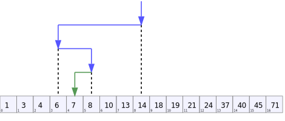

# Binary search 二分查找

在计算机科学中，二进制搜索，也称为半间隔搜索, 是一种在排序数组中查找目标值位置的搜索算法。二进制搜索将目标值与数组的中间元素进行比较；如果它们不相等，则排除目标不能位于的那一半，然后继续搜索剩余的一半，直到成功为止。如果搜索结束时剩下的一半为空，则目标不在数组中。



## Complexity

`O(log(n))`, 因为每一次的搜索都会使数据量减少一半

## implementation

```javascript
/**
 * Binary search
 * @param {Array} arr
 * @param {string} a
 * @return {number}
 */
function binarySearch(arr, a) {
  let startIndex = 0;
  let endIndex = arr.length;

  while (startIndex <= endIndex) {
    const midIndex = Math.floor((endIndex - startIndex) / 2) + startIndex;

    if (arr[midIndex] === a) {
      return midIndex;
    }

    if (arr[midIndex] > a) {
      endIndex = midIndex - 1;
    } else {
      startIndex = midIndex + 1;
    }
  }

  return -1;
}
```
