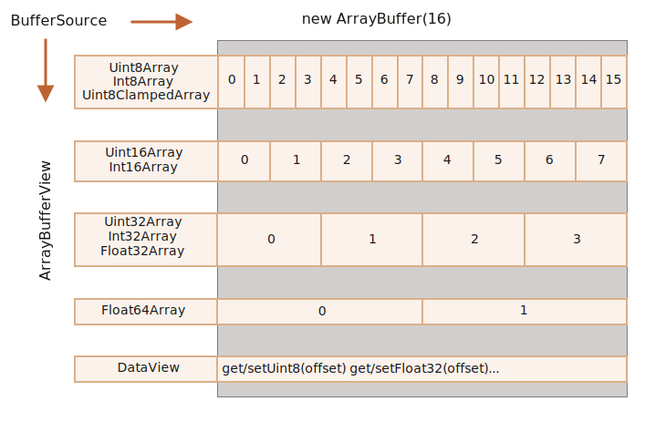

## 二进制数据

## ArrayBuffer

基本的二进制对象是 ArrayBuffer —— 对固定长度的连续内存空间的引用。ArrayBuffer 是一个内存区域。它里面存储了什么？无从判断。只是一个原始的字节序列。如要操作 ArrayBuffer，我们需要使用“视图”对象。视图对象本身并不存储任何东西。它是一副“眼镜”，透过它来解释存储在 ArrayBuffer 中的字节。


```javascript
// 创建
let buffer = new ArrayBuffer(8);

// 将 buffer 视为一个 8 位整数序列
let view = new Uint8Array(buffer);

// 写入值
view[0] = 120;

// 遍历
for (let n of view) {
  console.log(n);
}
```

## TypedArray

所有这些视图（Uint8Array，Uint32Array 等）的通用术语是 TypedArray。它们共享同一方法和属性集。没有名为 TypedArray 的构造器，它只是表示 ArrayBuffer 上的视图之一的通用总称术语：Int8Array，Uint8Array 及其他，很快就会有完整列表。

| 类型              | 范围                    | 大小 byte | 描述                                     |
| ----------------- | ----------------------- | --------- | ---------------------------------------- |
| Int8Array         | -128 to 127             | 1         | 8 位有符号二进制整数                     |
| Uint8Array        | 0 to 255                | 1         | 8 位无符号二进制整数, 超出后从另一边循环 |
| Uint8ClampedArray | 0 to 255                | 1         | 8 位无符号二进制整数, 超出后为边界值     |
| Int16Array        | -32768 to 32767         | 2         | 16 位有符号二进制整数                    |
| Uint16Array       | 0 to 65535              | 2         | 16 位无符号二进制整数                    |
| Int32Array        | -2^31 to 2^31-1         | 4         | 32 位有符号二进制整数                    |
| Uint32Array       | 0 to 2^32-1             | 4         | 32 位无符号二进制整数                    |
| Float32Array      | 1.2x10^-38 to 3.4x10^38 | 4         | 32 位 IEEE 浮点数                        |
| Float64Array      | 5x10^-324 to 1.8x10^308 | 8         | 64 位 IEEE 浮点数                        |

其中 TypedArray 是下面的一种之一

- Int8Array / Uint8Array / Uint8ClampedArray
- Int16Array / Uint16Array
- Int32Array / Uint32Array
- Float32Array / Float64Array

```javascript
new TypedArray();
new TypedArray(length);
new TypedArray(typedArray);
new TypedArray(object); // new Uint8Array(3)
new TypedArray(buffer [, byteOffset [, length ]]);
```

```javascript
const int8array = new Int8Array(3);
int8array[0] = 21;
console.log(int8array[0]); // 21

// 使用
const d1 = Int8Array.from([1, 2, 3]);
const d2 = Int8Array.of(1, 2, 3);
```

如要访问底层的 ArrayBuffer，那么在 TypedArray 中有如下的属性：

- arr.buffer —— 引用 ArrayBuffer。
- arr.byteLength —— ArrayBuffer 的长度。

类型化数组的行为类似于常规数组,具有索引，并且是可迭代(iterate), map, slice, find, reduce 等.

## DataView

DataView 是在 ArrayBuffer 上的一种特殊的超灵活“未类型化”视图。它允许以任何格式访问任何偏移量（offset）的数据。

- 对于类型化的数组，构造器决定了其格式。整个数组应该是统一的。第 i 个数字是 arr[i]。
- 通过 DataView，我们可以使用 .getUint8(i) 或 .getUint16(i) 之类的方法访问数据。我们在调用方法时选择格式，而不是在构造的时候。

```javascript
// buffer, 底层的 ArrayBuffer。
// byteOffset, 视图的起始字节位置（默认为 0）。
// byteLength, 视图的字节长度（默认至 buffer 的末尾）。
new DataView(buffer, [byteOffset], [byteLength]);

// 4 个字节的二进制数据
let buffer = new Uint8Array([255, 255, 255, 255]).buffer;

let dataView = new DataView(buffer);

// 在偏移量为 0 处获取 8 位数字
dataView.getUint8(0);

// 在偏移量为 0 处获取 16 位数字，它由 2 个字节组成，一起解析为 65535
dataView.getUint16(0);

// 在偏移量为 0 处获取 32 位数字
dataView.getUint32(0);

// 将 4 个字节的数字设为 0
dataView.setUint32(0, 0);
```


