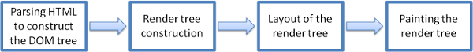

# Browser and how they work

请阅读这些资源

- <https://www.mozilla.org/en-US/firefox/browsers/what-is-a-browser />
- <https://www.freecodecamp.org/news/web-application-security-understanding-the-browser-5305ed2f1dac />
- <https://medium.com/@monica1109/how-does-web-browsers-work-c95ad628a509 />
- [how-browser-work](http://taligarsiel.com/Projects/howbrowserswork1.htm)

## How does web browsers work?

A browser is a software application used to locate, retrieve and display content on the World Wide Web, including Web pages, images, video and other files. As a client/server model, the browser is the client run on a computer that contacts the Web server and requests information. The Web server sends the information back to the Web browser which displays the results on the computer or other Internet-enabled device that supports a browser.

一个浏览器就是用来定位, 获取和展示因特网上内容的软件, 这些内容包括了网页, 图像, 视频和其他文件. 作为客户端/服务器模型, 浏览器是在客户端计算机上运行的软件用来跟 Web 服务器联系和请求信息. Web 服务器发送信息到浏览器, 在支持浏览器的计算机上或者其他支持 Internet 的设备上展示结果.

Today’s browsers are fully-functional software suites that can interpret and display HTML Web pages, applications, JavaScript, AJAX and other content hosted on Web servers. Many browsers offer plug-ins which extend the capabilities of the software so it can display multimedia information (including sound and video), or the browser can be used to perform tasks such as videoconferencing, to design web pages or add anti-phishing filters and other security features to the browser.

现今的浏览器是功能齐全的软件套件, 它可以解析和展示 HTML 网页, 应用程序, Ajax 和 其他托管在 Web 服务器上的内容. 许多浏览器都提供了扩展功能的插件, 使其显示多媒体信息(包括声音,视频), 或者浏览器可以执行视频会议, 设计网页或者向浏览器添加反钓鱼过滤器和其他安全特性的任务.

A browser is a group of structured codes which together performs a series of tasks to display a web page on the screen. According to the tasks they perform, these codes are made as different components.

一个浏览器是由一组结构化的代码组合起来执行一系列任务然后把网页展示在屏幕上, 根据他们执行的任务, 这些代码被设计成不同的组件.

#### High-level architecture of browser

The below image shows the main components of a web browser:
下面图像显示了浏览器的主要组件:

1. The User Interface: The user interface is the space where User interacts with the browser. It includes the address bar, back and next buttons, home button, refresh and stop, bookmark option, etc. Every other part, except the window where requested web page is displayed, comes under it.

> 用户界面: 用户界面就是用户与浏览器交互的空间. 包括了地址栏, 前进后退按钮, 主页按钮, 刷新和停止, 书签选项等. 除了显示请求网页的窗口外, 其他所有部分都是在它的下面.

2. The Browser Engine: The browser engine works as a bridge between the User interface and the rendering engine. According to the inputs from various user interfaces, it queries and manipulates the rendering engine.

> 浏览器引擎: 浏览器引擎充当用户界面和渲染引擎之间的桥梁. 根据不同用户界面的输入, 它用来查询和操作渲染引擎.

3. The Rendering Engine: The rendering engine, as the name suggests is responsible for rendering the requested web page on the browser screen. The rendering engine interprets the HTML, XML documents and images that are formatted using CSS and generates the layout that is displayed in the User Interface. However, using plugins or extensions, it can display other types data also. Different browsers user different rendering engines:

> 渲染引擎: 渲染引擎, 顾名思义, 它的职责是把网页渲染在屏幕上. 渲染引擎解析使用 CSS 格式化的 HTML, XML 文档和图像然后生成和显示在用户界面上的布局. 然而, 使用插件和扩展, 也可以展示其他类型的数据. 不同的浏览器使用不同的引擎:

- Internet Explorer: Trident
- Firefox & other Mozilla browsers: Gecko
- Chrome & Opera 15+: Blink
- Chrome (iPhone) & Safari: Webkit

4. Networking: Component of the browser which retrieves the URLs using the common internet protocols of HTTP or FTP. The networking component handles all aspects of Internet communication and security. The network component may implement a cache of retrieved documents in order to reduce network traffic.

> 网络: 网络组件是使用 HTTP 或者 FTP 通用互联网协议的 URLs 中获取信息的组件. 网络组件处理互联网通讯和安全的所有方面. 为了减少网络流量网络组件可能会实现获取文档缓存的功能.

5. JavaScript Interpreter: It is the component of the browser which interprets and executes the javascript code embedded in a website. The interpreted results are sent to the rendering engine for display. If the script is external then first the resource is fetched from the network. Parser keeps on hold until the script is executed.

> Javascript 解释器: 用来解释和执行嵌入在网页中 JavaScript 代码的组件. 解释的结果会发送到渲染引擎去展示. 如果脚本是外部的会先从网络中获取. 解析器一直保持不变，直到脚本被执行。

6. UI Backend: UI backend is used for drawing basic widgets like combo boxes and windows. This backend exposes a generic interface that is not platform specific. It underneath uses operating system user interface methods.

6> UI Backend: UI 后端是用来画类似于复选框等基本的小挂件和窗体的组件. 这个后端公开了一个非特定于平台的通用接口. 它在底层使用操作系统用户界面的方法.

7. Data Persistence/Storage: This is a persistence layer. Browsers support storage mechanisms such as localStorage, IndexedDB, WebSQL and FileSystem. It is a small database created on the local drive of the computer where the browser is installed. It manages user data such as cache, cookies, bookmarks and preferences.

> 数据持久/储存: 这是一个持久层. 浏览器支持存储机制, 例如 localStorage, IndexDB, WebSQL 和文件系统. 在浏览器安装的地方会创建一个小的数据库. 用来管理用户的数据, 例如缓存, cookies, 书签和个人偏好等.

#### Rendering engine

The networking layer will start sending the contents of the requested documents to the rendering engine in chunks of 8KBs.

网络层将请求的文档内容以8KBs大小分块然后发送给渲染引擎

The rendering engine parses the chunks of HTML document and convert the elements to DOM nodes in a tree called the “content tree” or the “DOM tree”. It also parses both the external CSS files as well in style elements.

渲染引擎解析分块的HTML文档内容然后将元素转换为被称为**内容树**或者**DOM树**的DOM节点. 同样也会解析外部的CSS文件和在style标签内的样式元素.

While the DOM tree is being constructed, the browser constructs another tree, the render tree. This tree is of visual elements in the order in which they will be displayed. It is the visual representation of the document. The purpose of this tree is to enable painting the contents in their correct order. Firefox calls the elements in the render tree “frames”. WebKit uses the term renderer or render object.

当DOM树构造完毕后, 浏览器会构建另外的树, 渲染树. 这棵树是用来显示有序可视元素的树. 它是文档的可视化呈现. 构造这棵树的目的是能够使内容正确有序的绘制. Firefox将渲染树中的元素称为**frames**, Webkit使用术语 **renderer** 或者 **render object**.

After the construction of the render tree, it goes through a “layout process” of the render tree. When the renderer is created and added to the tree, it does not have a position and size. The process of calculating these values is called layout or reflow. This means giving each node the exact coordinates where it should appear on the screen. The position of the root renderer is 0,0 and its dimensions are the viewport–the visible part of the browser window. All renderers have a “layout” or “reflow” method, each renderer invokes the layout method of its children that need layout.

在渲染树构造后, 会经历渲染树的**布局过程**. 当renderer被创建并添加到树中时, 它是没有位置和大小的. 计算这些值的过程被称为布局或者回流. 这就意味着在屏幕上为每一个节点赋予精确的坐标. renderer的根的位置为0,0, 它的大小是整个浏览器的视口部分. 所有的renderer都有一个 **layout** 和 **reflow** 方法,  当需要布局的时候, 每一个renderer会调用子renderer的**layout**方法.

The next stage is painting. In the painting stage, the render tree is traversed and the renderer’s “paint()” method is called to display content on the screen. Painting uses the UI backend layer.

下一个阶段是绘制. 在绘制阶段, 会遍历渲染树和调用renderer的**paint()**方法把内容绘制在屏幕上. 绘制使用UI Backend层的组件.

The rendering engine always tries to display the contents on the screen as soon as possible for better user experience. It does not wait for the HTML parsing to complete before starting to build and layout the render tree. It parses and displays the content it has received from the network, while rest of the contents stills keeps coming from the network.

为了更好的用户体验, 渲染树会尝试尽可能早的把内容展现在屏幕上. 它不会等到HTML页面完全解析之后在开始构建和布局渲染树. 它会解析和展示从网络接收到的内容, 并且保持持续接受来自网络层的内容.